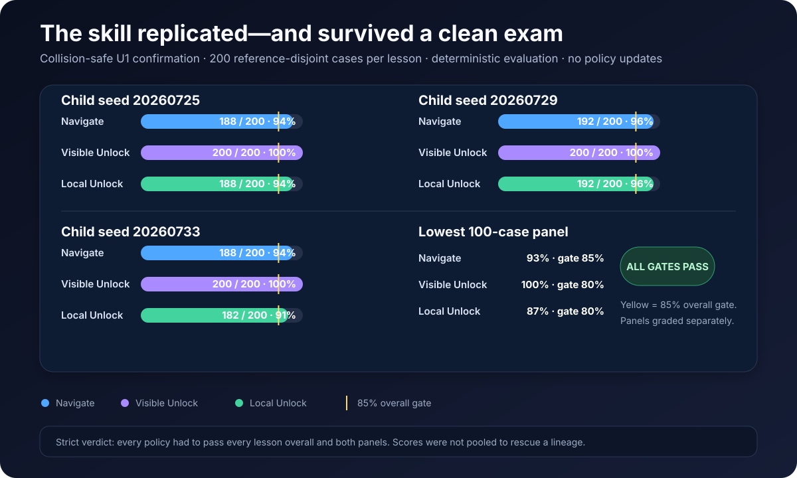
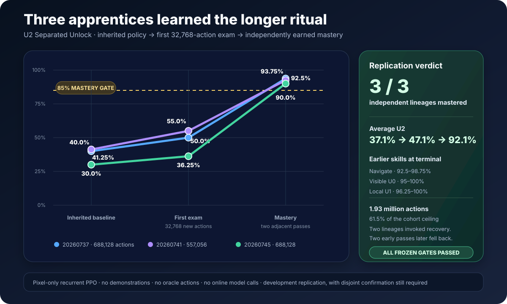
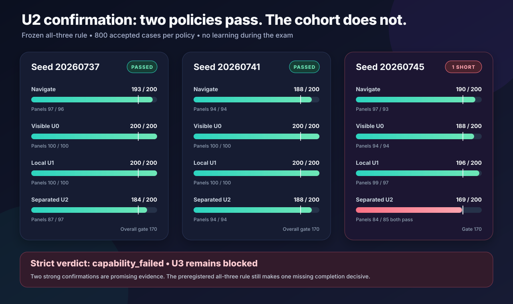

# Dungeon Apprentice

**Can one visual agent learn the idea of a quest—and use it in a dungeon it has never seen?**

Dungeon Apprentice is an original procedural game and a cumulative-learning experiment built on
MiniGrid. A local recurrent policy begins with random parameters and receives only a small pixel
view. It must learn navigation, interaction, memory, backtracking, and eventually combinations of
those skills without demonstrations, walkthroughs, coordinates, online model decisions, or human
controller actions.

The project begins deliberately small. Protocol v0.1 has three capability tiers:

| Tier | Objective | New demand |
| ---: | --- | --- |
| 0 — Navigate | Reach the green exit | Vision, movement, collision |
| 1 — Unlock | Find a colored key, unlock its door, reach the exit | Interaction and ordering |
| 2 — Retrieve | Unlock the door, collect the relic, return to the entrance | Memory and backtracking |

Every layout is generated from a seed and mechanically checked for solvability. Training and
evaluation use disjoint seed partitions. A policy advances only through frozen no-update exams on
unseen levels, and every promotion retests earlier tiers to detect forgetting.

The names `U0`–`U3` refer to progressively harder **Unlock lessons** inside Tier 1. In particular,
`U2 Separated Unlock` is not Tier 2 Retrieve. Retrieve remains a later relic-and-return capability.

## What makes this our game

MiniGrid supplies fast grid simulation and rendering. This repository owns the dungeon generator,
game rules, key-consumption mechanic, objective tiers, reward contract, agent information boundary,
solvability oracle, curriculum, evaluation suites, training runner, dashboard, and future mechanics.

The game can later grow to include multiple keys, decoys, levers, traps, enemies, inventory limits,
movable blocks, light, multiple floors, and composed final adventures. Those additions will be new
declared protocol versions rather than mid-run patches.

## Information boundary

The policy receives a `56 × 56 × 3` partial RGB image. It does not receive:

- its coordinates or facing direction as numbers;
- the full map or a visited-cell map;
- object names, route distance, shortest paths, or mission text;
- the procedural seed;
- oracle actions, demonstrations, pretrained weights, or online language-model output.

Trainer-only information records the tier, seed, success, timeout, and generated-layout signature.
It grades behavior but cannot choose a button.

## Installation

```bash
python3 -m venv .venv
.venv/bin/python -m pip install -e ".[dev,train]"
```

Prove the first 300 generated levels are solvable:

```bash
.venv/bin/dungeon-qualify --seeds 100
```

Launch the initial automatic curriculum:

```bash
.venv/bin/dungeon-train --total-timesteps 1000000
```

The training process writes a run manifest, atomic checkpoints, live status, evaluation history,
frames, and a local dashboard. Once launched from an ordinary Terminal session, gameplay and
learning are entirely local and consume no GPT or Codex usage.

The learner is recurrent PPO: a compact vision network interprets pixels, an LSTM carries memory
between steps, and PPO updates the policy from its own attempts. During training, bounded episodic
curiosity pays only for genuinely new pixel views. The bonus defaults to `0.002` per novel view and
can contribute at most `0.1` across an entire attempt; repeated or unchanged views pay zero.
Curiosity knows nothing about keys, doors, coordinates, routes, or objectives. Evaluation disables
it and measures game success alone.

## Current experimental status

The first v0 canary proved that the software could train and occasionally discover the exit, but it
did **not** establish learned capability. Its curiosity bonus could make unsuccessful wandering more
valuable than an efficient solution, and its scheduled exams ran before the newest PPO update. At
4,096 collected steps, the scheduled checkpoint had 70 optimizer updates; the final archive had 80
and was never evaluated.

Protocol v0.1 corrected those faults, treats v0 as engineering evidence only, and added reproducible
checkpoint/resume state plus a real train-save-resume-reload-evaluate CI check. Its local and GitHub
engineering gates passed. Three subsequent fresh v0.1 canaries then produced the first replicated
capability result: all three learned Navigate, reaching 90% held-out success after 163,840–196,608
trained actions.

The promotion exposed the next two problems. Every policy ended at exactly 75% Navigate retention,
and all three scored 0% on deterministic full Unlock. The supposed 30% Navigate rehearsal share was
only 4–6% of actual post-promotion transitions because short Navigate episodes and long Unlock
timeouts were sampled as equal episodes. See
[the immutable canary report](docs/results/v0.1-navigate-canaries.md).

The first [v0.2](docs/protocol-v0.2-design.md) implementation slice corrected that scheduler and
introduced a short but complete Visible Unlock quest. Three independently initialized policies all
mastered the key-to-door-to-exit sequence while retaining Navigate; their final U0 scores were
79/80, 80/80, and 80/80. The frozen
[replication report](docs/results/v0.2-visible-unlock-replication.md) records the full trajectories,
panels, allocations, artifact digests, and narrow claim.

Those replications shared one development validation suite, so a
[post-training confirmation](docs/v0.2-u0-confirmation-plan.md) was preregistered before inspecting
two disjoint 200-case blocks. All three selected checkpoints passed every overall and panel gate:
their U0 scores were 187/200, 199/200, and 198/200 while Navigate remained between 93.5% and 96.0%.
The frozen [confirmation report](docs/results/v0.2-u0-confirmation.md) supports advancing to U1
Local Unlock without claiming that unrestricted Unlock has already been learned.

The [warm-start U1 child](docs/protocol-v0.2-u1-development.md) then inherited the exact confirmed
seed-`20260725` U0 policy and optimizer and learned maps where the key begins visible but the door
does not. Its frozen U1 score rose from 0/80 before training to consecutive passes of 73/80 and 72/80
after 393,216 new actions, while final Navigate remained 74/80 and U0 reached 80/80. This is a
positive cumulative-learning result, but still one selected lineage. Two sequential children from
the other confirmed U0 parents are therefore frozen in the
[U1 replication plan](docs/v0.2-u1-replication-plan.md); both must master before the claim counts as
replicated. Both did: one mastered after 393,216 new actions and the other after 294,912, with all
three lineages finishing at 72/80 U1 while retaining Navigate and U0. The immutable
[replication result](docs/results/v0.2-local-unlock-replication.md) records the trajectories,
recoveries, allocations, and artifact digests.

Before advancing to U2, the project froze a larger
[U1 confirmation](docs/v0.2-u1-confirmation-plan.md). Its first attempt correctly stopped before
policy scoring when nine generated layouts repeated declared development evidence despite
numerically disjoint seeds. The
[immutable attempt-1 result](docs/results/v0.2-u1-confirmation-attempt-1.md) preserves that
qualification failure. A separately preregistered
[collision-safe successor](docs/v0.2-u1-confirmation-v2-plan.md) uses fresh candidate streams and a
policy-blind exact-layout exclusion rule rather than rewriting the first attempt.

That successor is now **confirmed**. Navigate accepted its first 200 candidates with no rejection;
Visible Unlock examined 236 to accept 200 after 36 rejections; and Local Unlock examined 207 to
accept 200 after seven. Every accepted lesson contained 200 unique exact layouts, with 200 unique
geometries for Navigate and U1 and 180 for the intentionally finite U0 retention task. The three
frozen policies then scored:

| U1 child seed | Navigate | Visible Unlock U0 | Local Unlock U1 |
| ---: | ---: | ---: | ---: |
| `20260725` | 188/200 | 200/200 | 188/200 |
| `20260729` | 192/200 | 200/200 | 192/200 |
| `20260733` | 188/200 | 200/200 | 182/200 |



All nine overall gates and all 18 panel gates passed. Evaluation performed no updates: policy,
optimizer, archive, timestep, and update-counter evidence remained unchanged for every checkpoint.
The raw v2 report SHA-256 is
`6e577170050f6f14599b793a031776a19bf7c64eba0f243f457298da3193ae8f`; the readable
[confirmation v2 result](docs/results/v0.2-u1-confirmation-v2.md) records the complete evidence.
This supports beginning the separately frozen
[U2 Separated Unlock protocol](docs/protocol-v0.2-u2-separated-unlock.md), not a claim that full
Unlock, Retrieve, or the whole game has already been solved.

### U2 Separated Unlock — replicated development result; strict confirmation not passed

The disposable engineering partition has now passed a complete 1,000-map generator/oracle sweep.
See the [U2 engineering sandbox report](docs/results/v0.2-u2-engineering-sandbox.md). This verifies
the proposed lesson machinery only; it is deliberately not counted as policy-learning evidence.
The subsequent [launch-readiness record](docs/results/v0.2-u2-launch-readiness.md) preserves the
full acceptance checks and every final audit finding before protected access.

U2 does not merge the three confirmed policies or restart from random weights. Each exact confirmed
U1 archive becomes the parent of its own child, including its optimizer state. The three children
then face the same new question independently and sequentially: can a policy that learned a local
key → door → exit ritual extend it into a longer search while retaining everything beneath it?

All three children answered that development question positively. Their frozen Separated Unlock
scores rose from 40.0%, 41.25%, and 30.0% at inheritance to 93.75%, 92.5%, and 90.0% at mastery.
They stopped after 688,128, 557,056, and 688,128 new actions while every final Navigate, U0, and U1
exam remained above its gate.

| U2 child seed | Baseline U2 | First 32,768-action exam | Terminal U2 | New actions |
| ---: | ---: | ---: | ---: | ---: |
| `20260737` | 32/80 | 40/80 | 75/80 | 688,128 |
| `20260741` | 33/80 | 44/80 | 74/80 | 557,056 |
| `20260745` | 24/80 | 29/80 | 72/80 | 688,128 |



The immutable
[U2 replication result](docs/results/v0.2-u2-separated-unlock-replication.md) records the full
trajectories, recovery episodes, allocation evidence, checkpoint digests, and narrow claim. This is
replicated learning evidence on frozen development suites.

The separately preregistered collision-aware confirmation has now run once. Two frozen policies
passed every Navigate, U0, U1, and U2 gate. The third retained all three earlier lessons and passed
both U2 panels, but completed 169/200 U2 cases against the frozen 170/200 overall requirement:

| U2 child seed | Navigate | Visible U0 | Local U1 | Separated U2 | Strict result |
| ---: | ---: | ---: | ---: | ---: | --- |
| `20260737` | 193/200 | 200/200 | 200/200 | 184/200 | Passed |
| `20260741` | 188/200 | 200/200 | 200/200 | 188/200 | Passed |
| `20260745` | 190/200 | 188/200 | 196/200 | **169/200** | Failed U2 overall by 1 |



All 24 panel gates passed, but only 11 of 12 lesson-level overall gates passed. Because the
preregistered rule required all three policies to pass independently, the immutable verdict is
**`capability_failed`**, not confirmed. The
[U2 confirmation result](docs/results/v0.2-u2-confirmation.md) preserves the full candidate
selection, rejection accounting, no-update evidence, launch defects, hashes, diagnostics, and
limits. U3 remains blocked.

Separated Unlock remains a small 9 × 9 world, but the locked door is now the only opening through a
complete divider. The agent and matching key begin on the approach side, the goal is on the far
side, and exactly two additional interior walls lengthen or redirect the route. Neither key nor door
is guaranteed to begin in view. A pure planner and a separately executed live oracle must agree on
a legal 17–26-action solution before a layout can qualify.

The learning interface does not become easier:

- the policy still receives only the same `56 × 56 × 3` partial pixels and recurrent state;
- it still chooses from the same seven primitive actions;
- the recurrent-PPO architecture, optimizer settings, step cost, success reward, and bounded
  pixel-curiosity contract remain unchanged; and
- key pickup and door opening remain diagnostics, not shaped rewards or demonstrations.

Every post-update exam measures four skills at once: Navigate, Visible Unlock, Local Unlock, and
Separated Unlock. A weakened prerequisite automatically changes the next practice mix, but recovery
cannot count toward U2 mastery. Two allocation-valid normal-practice boundaries must pass every
overall and 40-case panel gate. Each exam names and hashes the exact post-optimizer checkpoint bytes
it measured.

The evidence ladder is intentionally split:

| Stage | What it can prove | What it cannot prove |
| --- | --- | --- |
| Engineering acceptance and one-shot 2,000-layout oracle qualification | The generator, oracle, resume path, storage guards, and measurement machinery obey the frozen contract | That a policy learned U2 |
| Three sequential U2 children | Whether each confirmed U1 lineage learns and retains the four declared skills within its own budget | Generalization beyond the development validation suites |
| Completed, separately preregistered no-update confirmation | Two checkpoints passed; the third retained prior skills but missed U2 overall by one, so the strict cohort did not confirm | U3, Retrieve, unrestricted puzzle solving, or the complete game |

Training layouts remain in `0`–`999_999`; engineering work has its own `5_200_000` sandbox; the
sealed one-shot qualification is `5_210_000`–`5_211_999`; the four validation suites occupy their
declared 10–11.2-million blocks; the now-consumed U2 confirmation streams occupy
`15_200_000`–`15_239_999`; and the 20-million final allocation remains untouched. The committed
implementation freeze correctly
recorded that no protected case had yet opened. The subsequently anchored external qualification
and cohort ledgers are the authority for the completed run. The 15.2-million confirmation streams
are now opened, immutable evidence; the final partition remains untouched.

The cohort ran one CPU trainer at a time on the audited 8 GB M1 and was observed through one
read-only dashboard. The completed sequential cohort took 3 hours, 41 minutes, and 26 seconds,
used 1,933,312 of its possible 3,145,728 child actions, and retained about 826 MiB of scientific
evidence. The separately preregistered
[U2 confirmation](docs/v0.2-u2-confirmation-plan.md) evaluated the three frozen first-mastery
archives on prospectively selected, collision-aware cases with no policy update. Two passed; child
`20260745` missed the frozen U2 overall gate by one. The selector excluded validation,
qualification, prior-confirmation, and completed logged training histories while retaining the
declared bounded 12-layout terminal logging limitation. The strict failure means U3 Full Unlock
design cannot activate from this evidence.

## Evidence standard

Training reward, loss, map coverage, and one lucky completion are diagnostics. The behavioral
authority is deterministic evaluation on held-out seeds:

- protocol v0.1 promotion threshold: at least 90% success on the current tier;
- protocol v0.1 retention threshold: at least 80% on every earlier tier;
- later protocols freeze their own lesson-specific overall and panel gates before training; see
  each protocol and preregistration rather than treating the v0.1 percentages as universal;
- validation suite: seeds beginning at `10_000_000`;
- untouched final suite: seeds beginning at `20_000_000`.

Collected experience and trained experience are reported separately. Exams and public checkpoints
are emitted after optimization. Every exam record names the exact checkpoint path and SHA-256 digest
it graded, while milestone rates and movement diagnostics make partial progress visible without
changing the pixels supplied to the policy.

See [the experiment contract](docs/experiment-contract.md),
[learning design](docs/learning-design.md), [operations runbook](docs/runbook.md),
[experiment log](docs/experiment-log.md), [video notebook](docs/video-narrative.md),
[architecture](docs/architecture.md), [audit and remediation record](docs/audit.md), and
[roadmap](docs/roadmap.md). The completed v0.1 capability result is preserved in the
[Navigate canary report](docs/results/v0.1-navigate-canaries.md), and the next proposed protocol is
specified in [the v0.2 design](docs/protocol-v0.2-design.md). The current controlled decision point
is a prospectively frozen response to the failed U2 confirmation; U3 remains blocked until U2
satisfies a new valid advancement gate.
