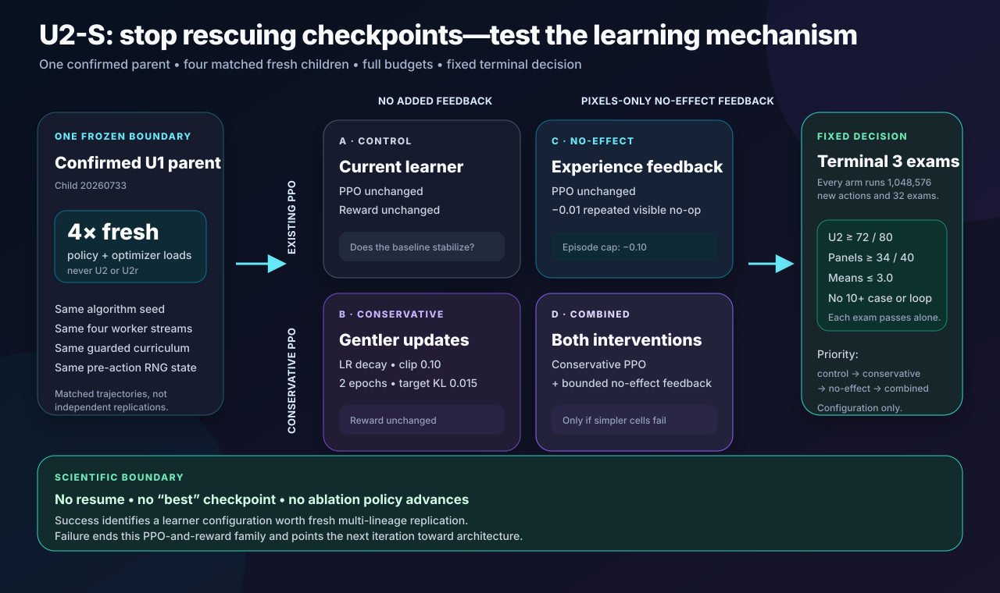

# Dungeon Apprentice

**Can one visual agent learn the idea of a quest—and use it in a dungeon it has never seen?**

Dungeon Apprentice is an original procedural game and a cumulative-learning experiment built on
MiniGrid. A local recurrent policy begins with random parameters and receives only a small pixel
view. It must learn navigation, interaction, memory, backtracking, and eventually combinations of
those skills without demonstrations, walkthroughs, coordinates, online model decisions, or human
controller actions.

The project begins deliberately small. Protocol v0.1 has three capability tiers:

| Tier | Objective | New demand |
| ---: | --- | --- |
| 0 — Navigate | Reach the green exit | Vision, movement, collision |
| 1 — Unlock | Find a colored key, unlock its door, reach the exit | Interaction and ordering |
| 2 — Retrieve | Unlock the door, collect the relic, return to the entrance | Memory and backtracking |

Every layout is generated from a seed and mechanically checked for solvability. Training and
evaluation use disjoint seed partitions. A policy advances only through frozen no-update exams on
unseen levels, and every promotion retests earlier tiers to detect forgetting.

The names `U0`–`U3` refer to progressively harder **Unlock lessons** inside Tier 1. In particular,
`U2 Separated Unlock` is not Tier 2 Retrieve. Retrieve remains a later relic-and-return capability.

## What makes this our game

MiniGrid supplies fast grid simulation and rendering. This repository owns the dungeon generator,
game rules, key-consumption mechanic, objective tiers, reward contract, agent information boundary,
solvability oracle, curriculum, evaluation suites, training runner, dashboard, and future mechanics.

The game can later grow to include multiple keys, decoys, levers, traps, enemies, inventory limits,
movable blocks, light, multiple floors, and composed final adventures. Those additions will be new
declared protocol versions rather than mid-run patches.

## Information boundary

The established v0.2 policy receives a `56 × 56 × 3` partial RGB image. The completed v0.3 study
tested the agent's immediately preceding primitive action plus whether the next visible pixels
changed. The completed v0.4 study replaced that input with one bounded persistence scalar:
`min(consecutive same-action unchanged frames, 9) / 9`. Its matched sham computed the same
counter but exposed zero, while the candidate exposed the truthful scalar; neither v0.4 arm
received the action identity. These are facts available from the agent's own sensorimotor
experience. No tested version receives:

- its coordinates or facing direction as numbers;
- the full map or a visited-cell map;
- object names, route distance, shortest paths, or mission text;
- the procedural seed;
- oracle actions, demonstrations, externally pretrained game knowledge, or online language-model
  output.

Trainer-only information records the tier, seed, success, timeout, and generated-layout signature.
It grades behavior but cannot choose a button.


## Installation

```bash
python3 -m venv .venv
.venv/bin/python -m pip install -e ".[dev,train]"
```

Prove the first 300 generated levels are solvable:

```bash
.venv/bin/dungeon-qualify --seeds 100
```

Launch the initial automatic curriculum:

```bash
.venv/bin/dungeon-train --total-timesteps 1000000
```

The training process writes a run manifest, atomic checkpoints, live status, evaluation history,
frames, and a local dashboard. Once launched from an ordinary Terminal session, gameplay and
learning are entirely local and consume no GPT or Codex usage.

The learner is recurrent PPO: a compact vision network interprets pixels, an LSTM carries memory
between steps, and PPO updates the policy from its own attempts. During training, bounded episodic
curiosity pays only for genuinely new pixel views. The bonus defaults to `0.002` per novel view and
can contribute at most `0.1` across an entire attempt; repeated or unchanged views pay zero.
Curiosity knows nothing about keys, doors, coordinates, routes, or objectives. Evaluation disables
it and measures game success alone.

## Current experimental status

The first v0 canary proved that the software could train and occasionally discover the exit, but it
did **not** establish learned capability. Its curiosity bonus could make unsuccessful wandering more
valuable than an efficient solution, and its scheduled exams ran before the newest PPO update. At
4,096 collected steps, the scheduled checkpoint had 70 optimizer updates; the final archive had 80
and was never evaluated.

Protocol v0.1 corrected those faults, treats v0 as engineering evidence only, and added reproducible
checkpoint/resume state plus a real train-save-resume-reload-evaluate CI check. Its local and GitHub
engineering gates passed. Three subsequent fresh v0.1 canaries then produced the first replicated
capability result: all three learned Navigate, reaching 90% held-out success after 163,840–196,608
trained actions.

The promotion exposed the next two problems. Every policy ended at exactly 75% Navigate retention,
and all three scored 0% on deterministic full Unlock. The supposed 30% Navigate rehearsal share was
only 4–6% of actual post-promotion transitions because short Navigate episodes and long Unlock
timeouts were sampled as equal episodes. See
[the immutable canary report](docs/results/v0.1-navigate-canaries.md).

The first [v0.2](docs/protocol-v0.2-design.md) implementation slice corrected that scheduler and
introduced a short but complete Visible Unlock quest. Three independently initialized policies all
mastered the key-to-door-to-exit sequence while retaining Navigate; their final U0 scores were
79/80, 80/80, and 80/80. The frozen
[replication report](docs/results/v0.2-visible-unlock-replication.md) records the full trajectories,
panels, allocations, artifact digests, and narrow claim.

Those replications shared one development validation suite, so a
[post-training confirmation](docs/v0.2-u0-confirmation-plan.md) was preregistered before inspecting
two disjoint 200-case blocks. All three selected checkpoints passed every overall and panel gate:
their U0 scores were 187/200, 199/200, and 198/200 while Navigate remained between 93.5% and 96.0%.
The frozen [confirmation report](docs/results/v0.2-u0-confirmation.md) supports advancing to U1
Local Unlock without claiming that unrestricted Unlock has already been learned.

The [warm-start U1 child](docs/protocol-v0.2-u1-development.md) then inherited the exact confirmed
seed-`20260725` U0 policy and optimizer and learned maps where the key begins visible but the door
does not. Its frozen U1 score rose from 0/80 before training to consecutive passes of 73/80 and 72/80
after 393,216 new actions, while final Navigate remained 74/80 and U0 reached 80/80. This is a
positive cumulative-learning result, but still one selected lineage. Two sequential children from
the other confirmed U0 parents are therefore frozen in the
[U1 replication plan](docs/v0.2-u1-replication-plan.md); both must master before the claim counts as
replicated. Both did: one mastered after 393,216 new actions and the other after 294,912, with all
three lineages finishing at 72/80 U1 while retaining Navigate and U0. The immutable
[replication result](docs/results/v0.2-local-unlock-replication.md) records the trajectories,
recoveries, allocations, and artifact digests.

Before advancing to U2, the project froze a larger
[U1 confirmation](docs/v0.2-u1-confirmation-plan.md). Its first attempt correctly stopped before
policy scoring when nine generated layouts repeated declared development evidence despite
numerically disjoint seeds. The
[immutable attempt-1 result](docs/results/v0.2-u1-confirmation-attempt-1.md) preserves that
qualification failure. A separately preregistered
[collision-safe successor](docs/v0.2-u1-confirmation-v2-plan.md) uses fresh candidate streams and a
policy-blind exact-layout exclusion rule rather than rewriting the first attempt.

That successor is now **confirmed**. Navigate accepted its first 200 candidates with no rejection;
Visible Unlock examined 236 to accept 200 after 36 rejections; and Local Unlock examined 207 to
accept 200 after seven. Every accepted lesson contained 200 unique exact layouts, with 200 unique
geometries for Navigate and U1 and 180 for the intentionally finite U0 retention task. The three
frozen policies then scored:

| U1 child seed | Navigate | Visible Unlock U0 | Local Unlock U1 |
| ---: | ---: | ---: | ---: |
| `20260725` | 188/200 | 200/200 | 188/200 |
| `20260729` | 192/200 | 200/200 | 192/200 |
| `20260733` | 188/200 | 200/200 | 182/200 |


All nine overall gates and all 18 panel gates passed. Evaluation performed no updates: policy,
optimizer, archive, timestep, and update-counter evidence remained unchanged for every checkpoint.
The raw v2 report SHA-256 is
`6e577170050f6f14599b793a031776a19bf7c64eba0f243f457298da3193ae8f`; the readable
[confirmation v2 result](docs/results/v0.2-u1-confirmation-v2.md) records the complete evidence.
This supports beginning the separately frozen
[U2 Separated Unlock protocol](docs/protocol-v0.2-u2-separated-unlock.md), not a claim that full
Unlock, Retrieve, or the whole game has already been solved.

### U2 Separated Unlock — replicated development result; strict confirmation not passed

The disposable engineering partition has now passed a complete 1,000-map generator/oracle sweep.
See the [U2 engineering sandbox report](docs/results/v0.2-u2-engineering-sandbox.md). This verifies
the proposed lesson machinery only; it is deliberately not counted as policy-learning evidence.
The subsequent [launch-readiness record](docs/results/v0.2-u2-launch-readiness.md) preserves the
full acceptance checks and every final audit finding before protected access.

U2 does not merge the three confirmed policies or restart from random weights. Each exact confirmed
U1 archive becomes the parent of its own child, including its optimizer state. The three children
then face the same new question independently and sequentially: can a policy that learned a local
key → door → exit ritual extend it into a longer search while retaining everything beneath it?

All three children answered that development question positively. Their frozen Separated Unlock
scores rose from 40.0%, 41.25%, and 30.0% at inheritance to 93.75%, 92.5%, and 90.0% at mastery.
They stopped after 688,128, 557,056, and 688,128 new actions while every final Navigate, U0, and U1
exam remained above its gate.

| U2 child seed | Baseline U2 | First 32,768-action exam | Terminal U2 | New actions |
| ---: | ---: | ---: | ---: | ---: |
| `20260737` | 32/80 | 40/80 | 75/80 | 688,128 |
| `20260741` | 33/80 | 44/80 | 74/80 | 557,056 |
| `20260745` | 24/80 | 29/80 | 72/80 | 688,128 |


The immutable
[U2 replication result](docs/results/v0.2-u2-separated-unlock-replication.md) records the full
trajectories, recovery episodes, allocation evidence, checkpoint digests, and narrow claim. This is
replicated learning evidence on frozen development suites.

The separately preregistered collision-aware confirmation has now run once. Two frozen policies
passed every Navigate, U0, U1, and U2 gate. The third retained all three earlier lessons and passed
both U2 panels, but completed 169/200 U2 cases against the frozen 170/200 overall requirement:

| U2 child seed | Navigate | Visible U0 | Local U1 | Separated U2 | Strict result |
| ---: | ---: | ---: | ---: | ---: | --- |
| `20260737` | 193/200 | 200/200 | 200/200 | 184/200 | Passed |
| `20260741` | 188/200 | 200/200 | 200/200 | 188/200 | Passed |
| `20260745` | 190/200 | 188/200 | 196/200 | **169/200** | Failed U2 overall by 1 |


All 24 panel gates passed, but only 11 of 12 lesson-level overall gates passed. Because the
preregistered rule required all three policies to pass independently, the immutable verdict is
**`capability_failed`**, not confirmed. The
[U2 confirmation result](docs/results/v0.2-u2-confirmation.md) preserves the full candidate
selection, rejection accounting, no-update evidence, launch defects, hashes, diagnostics, and
limits. U3 remains blocked.

Separated Unlock remains a small 9 × 9 world, but the locked door is now the only opening through a
complete divider. The agent and matching key begin on the approach side, the goal is on the far
side, and exactly two additional interior walls lengthen or redirect the route. Neither key nor door
is guaranteed to begin in view. A pure planner and a separately executed live oracle must agree on
a legal 17–26-action solution before a layout can qualify.

The learning interface does not become easier:

- the policy still receives only the same `56 × 56 × 3` partial pixels and recurrent state;
- it still chooses from the same seven primitive actions;
- the recurrent-PPO architecture, optimizer settings, step cost, success reward, and bounded
  pixel-curiosity contract remain unchanged; and
- key pickup and door opening remain diagnostics, not shaped rewards or demonstrations.

Every post-update exam measures four skills at once: Navigate, Visible Unlock, Local Unlock, and
Separated Unlock. A weakened prerequisite automatically changes the next practice mix, but recovery
cannot count toward U2 mastery. Two allocation-valid normal-practice boundaries must pass every
overall and 40-case panel gate. Each exam names and hashes the exact post-optimizer checkpoint bytes
it measured.

The evidence ladder is intentionally split:

| Stage | What it can prove | What it cannot prove |
| --- | --- | --- |
| Engineering acceptance and one-shot 2,000-layout oracle qualification | The generator, oracle, resume path, storage guards, and measurement machinery obey the frozen contract | That a policy learned U2 |
| Three sequential U2 children | Whether each confirmed U1 lineage learns and retains the four declared skills within its own budget | Generalization beyond the development validation suites |
| Completed, separately preregistered no-update confirmation | Two checkpoints passed; the third retained prior skills but missed U2 overall by one, so the strict cohort did not confirm | U3, Retrieve, unrestricted puzzle solving, or the complete game |

Training layouts remain in `0`–`999_999`; engineering work has its own `5_200_000` sandbox; the
sealed one-shot qualification is `5_210_000`–`5_211_999`; the four validation suites occupy their
declared 10–11.2-million blocks; the now-consumed U2 confirmation streams occupy
`15_200_000`–`15_239_999`; and the 20-million final allocation remains untouched. The committed
implementation freeze correctly
recorded that no protected case had yet opened. The subsequently anchored external qualification
and cohort ledgers are the authority for the completed run. The 15.2-million confirmation streams
are now opened, immutable evidence; the final partition remains untouched.

The cohort ran one CPU trainer at a time on the audited 8 GB M1 and was observed through one
read-only dashboard. The completed sequential cohort took 3 hours, 41 minutes, and 26 seconds,
used 1,933,312 of its possible 3,145,728 child actions, and retained about 826 MiB of scientific
evidence. The separately preregistered
[U2 confirmation](docs/v0.2-u2-confirmation-plan.md) evaluated the three frozen first-mastery
archives on prospectively selected, collision-aware cases with no policy update. Two passed; child
`20260745` missed the frozen U2 overall gate by one. The selector excluded validation,
qualification, prior-confirmation, and completed logged training histories while retaining the
declared bounded 12-layout terminal logging limitation. The strict failure means U3 Full Unlock
protected work cannot activate from this evidence.

### U2r Stability Remediation — complete, valid terminal stability failure

The [U2r protocol](docs/protocol-v0.2-u2r-stability-remediation.md) kept the original
`capability_failed` verdict intact and permitted one bounded continuation of only child `20260745`.
Its first externally tagged launch remains an
[immutable zero-action operational failure](docs/results/v0.2-u2r-launch-attempt-1.md): a global
history guard left only 26 of finite U0's 2,800 exact layouts and initial reset exhausted 128
proposals before policy action one.

r1 amended only that U0 guard. It retained the exact U2 parent and optimizer, all eleven remaining
32,768-action windows, unchanged PPO/reward/curriculum, algorithm and worker streams
`20260749`–`20260752`, and terminal-only selection. It then completed normally:

| Boundary | Navigate | Visible U0 | Local U1 | Separated U2; panels | U2 ineffective |
| --- | ---: | ---: | ---: | --- | ---: |
| Inherited source | 79/80 | 76/80 | 77/80 | 72/80; 36, 36 | 6.5375 |
| First r1 exam | 73/80 | 78/80 | 76/80 | 70/80; 35, 35 | 11.8500 |
| Penultimate | 78/80 | 80/80 | 80/80 | **76/80; 37, 39** | **0.1875** |
| Terminal | 77/80 | 80/80 | 80/80 | **76/80; 37, 39** | **4.1625** |

The exact terminal policy retained strong capability, but the frozen stability maximum was 3.0.
Two U2 cases generated 299 of 333 ineffective interactions: one repeated toggle 145 times after
opening the door, and one repeated pickup 153 times. Every other terminal check passed. The machine
verdict is therefore **`failed`**, not a crash and not eligible for the fresh confirmation.

The full [authenticated U2r-r1 result](docs/results/v0.2-u2r-r1-stability.md) records all eleven
exams, 3,520 case records, tail diagnostics, counters, hashes, storage, and claim limits. The
terminal report SHA-256 is
`dcfbcbc9fb3e042d44c1bb7762479f005a24a989a96611b85b102c34f955fcc2`.
The attractive penultimate checkpoint cannot replace the prospectively required terminal artifact.
The reserved `15_240_000`–`15_279_999` confirmation candidates remained unopened, both U2r roots
are terminal evidence, and U3 remains closed.

### U2-S r1 — complete matched ablation; no mechanism selected

U2r showed that more unchanged PPO experience could produce excellent behavior temporarily without
preserving it reliably. U2-S therefore separated two candidate mechanisms:

| Arm | PPO | Pixels-only repeated no-effect feedback |
| --- | --- | --- |
| Control | Existing | Off |
| Conservative | Decaying learning rate, tighter clipping, two epochs, target KL | Off |
| No-effect | Existing | `-0.01` on the second and later identical visibly ineffective interaction, capped at `-0.10` per episode |
| Combined | Conservative | On |



After that safely preserved zero-action attempt, r1 completed all four matched arms. Each began
fresh from confirmed U1 child `20260733`, ran the full 1,048,576-action budget, and produced all 32
frozen exams. The fixed terminal-three outcome was:

| Arm | First exam | Final three U2 scores | Cases with 10+ ineffective interactions | Worst terminal case |
| --- | ---: | --- | --- | --- |
| Control | 21/80 | 78, 76, 77 | 3, 1, 2 | 124, 156, 21 |
| Conservative | 31/80 | 64, 64, 64 | 0, 3, 2 | 5, 152, 155 |
| No-effect | 33/80 | 78, 79, 76 | 0, 1, 1 | 2, 28, 126 |
| Combined | 36/80 | 70, 69, 71 | 0, 0, 0 | 7, 1, 7 |

Control retained capability but not reliability. Conservative PPO suppressed capability without
removing every tail. No-effect came closest to joining both, yet still produced rare catastrophic
loops. Combined removed the tails but finished just below the frozen 72/80 capability floor in all
three deciding exams. No arm passed every gate; the authenticated verdict is
**`ablation_failed`**. No configuration, checkpoint, successor cohort, confirmation, or U3
activation was selected. The full
[U2-S result](docs/results/v0.2-u2s-r1-stability-ablation.md) preserves the exact evidence and
claim limits.

### v0.3 — the action-effect pathway learned, but did not solve the tail

The ablation resolved the next design decision: another reward amount or gentler PPO schedule is
not enough. The original
[v0.3 architecture protocol](docs/protocol-v0.3-action-effect-architecture.md) moved the missing
causal fact into a learnable network pathway; its operationally corrected
[r1 replacement](docs/protocol-v0.3-action-effect-architecture-r1.md) preserved that scientific
question unchanged and fixed the dashboard boundary. Its launcher then exposed a second,
independent process-control defect.
[r2](docs/protocol-v0.3-action-effect-architecture-r2.md) preserved the same question while
correcting process classification and abnormal-exit cleanup. It completed the entire sham arm,
then exposed a third operational defect in terminal evidence authentication. The frozen
[r3 protocol](docs/protocol-v0.3-action-effect-architecture-r3.md) changed only that byte-level
verification contract, then finally completed the matched scientific test.

Both fresh twins inherit the exact confirmed U1 `20260733` CNN, actor/critic LSTMs, action/value
heads, and Adam moments by parameter name. Both have the same new nine-value input and a
zero-initialized residual into the existing 512-feature representation. The sham always receives
zeros. The action-effect twin receives a one-hot copy of its own previous action plus a
changed/unchanged comparison of two consecutive visible frames. It receives no game state, object
name, reward label, route, demonstration, or online model advice.

Because the residual begins exactly at zero, the transplanted model must reproduce the U1 parent's
features, values, deterministic actions, and recurrent states exactly. The two arms must also
produce the same first real 2,048-transition trajectory; learning may make them diverge only after
the first optimizer phase. Reward, curiosity, PPO, curriculum, horizons, full action budget, and
the complete U2-S terminal-three gate remain fixed.

This first stage could select only the architecture definition. Its checkpoints were development
artifacts and could not be promoted. A genuine candidate pass would have authorized a separately
frozen three-parent replication; r3 did not pass, so that Stage B replication did not open.

Attempt 0 froze source commit `5b135a4e2953db9f14e83cdaba77fe219fecb160`, published its
annotated tag, and passed the one-shot qualification. Its dashboard then repeated the complete
predecessor and qualification authentication on every live request. That work exceeded the
launcher's ten-second client deadline, producing three preserved `BrokenPipeError` records. The
launcher stopped before an arm directory, supervisor, trainer, action, update, checkpoint, or media
artifact existed. Its fail-closed trap wrote a synthetic sham crash record, correctly sealing the
root as `operationally_incomplete`. This is a zero-action operational failure, not a learning
result; see the [attempt-0 closeout](docs/results/v0.3-action-effect-launch-attempt-0.md).

r1 changed no scientific variable. Its dashboard deep-authenticated once before binding, every
live poll reread mutable status, and the health check succeeded. The learner started, verified its
first matched sham rollout, and reached 38,912 trained child actions. Final status recorded 40,004
collected actions; the later append-only episode ledger reached 40,960. The sham completed 19
optimizer phases, 76 new optimizer updates, and one scheduled 32,768-action exam boundary. Its one
baseline plus one scheduled exam produced eight lesson rows and 640 deterministic cases.

The launcher's whole-command-line process search then counted the supervisor's embedded child
command as a second trainer. The failed shell function also bypassed the intended `EXIT` cleanup,
so sham continued until explicitly stopped. No safe checkpoint exists, the action-effect arm never
started, and the matched scientific comparison never occurred. r1 is terminal
`operationally_incomplete`; see the
[authenticated incident record](docs/results/v0.3-action-effect-stage-a-r1-operational-failure.md).
Its roots and checkpoints are immutable and unusable.

r2 froze source `01b1b910…`, published and qualified its annotated tag, and launched the assigned
fresh cohort in the correct sham-first order. Sham then completed 1,048,576 child actions, 2,048
new optimizer updates, and all 32 exams. Its terminal three U2 scores were 77, 78, and 78/80, but
the middle exam contained one 85-action ineffective/repeated-interaction tail.

The learner closed normally. The manifest then recomputed the authentic first-rollout aggregate
without the final line-feed byte used by qualification and training. It obtained `3b9ecf3a…`
instead of the recorded `fa4c7bda…` and stopped fail-closed. Action-effect never received an
attempt, so r2 produced no matched architecture verdict. Its exact evidence is preserved in the
[r2 operational-failure result](docs/results/v0.3-action-effect-stage-a-r2-operational-failure.md).

r3 retained r2's dashboard, process classification, cleanup, confirmed-U1 parent, seeds, reward,
PPO, curriculum, budget, guard, exam cases, and terminal-three rule. It shared the qualified
line-feed-terminated digest profile across qualification, training, and closeout. Both arms
restarted fresh; no r2 policy or optimizer state crossed the boundary.

| Boundary | Sham | Action-effect |
| --- | ---: | ---: |
| Child actions / new updates / frozen exams | 1,048,576 / 2,048 / 32 | 1,048,576 / 2,048 / 32 |
| First 32,768-action U2 exam | 25/80 | 27/80 |
| Terminal-three U2 | 77, 78, 78 | 70, 72, 75 |
| Terminal-three 10+ ineffective cases | 0, 1, 0 | 6, 2, 1 |
| Worst terminal ineffective/repeat run | 3/3, 85/85, 9/8 | 160/160, 124/124, 152/149 |
| Eligible | No; calibration only | No |

The complete 2,048-transition pre-update rollout matched at
`fa4c7bda99a261f8fa49741a49360cd1bfc6ab3081db51aeffc64266a109ce72`.
The candidate encoder then became nonzero exactly at the first optimizer boundary and ended with all
4,608 weights nonzero. This matters: the candidate learned, improved U2 from the inherited 24/80
baseline to 75/80, and demonstrably used the new pathway. It still failed the frozen rule because
its first deciding exam scored 70/80 and every deciding exam contained a forbidden long
ineffective/repeated-action tail.

The authenticated result is **`architecture_failed`**, with no selected architecture and no
checkpoint reuse. Sham is not a winner; it is calibration evidence. Stage B was not authorized,
and U3 remains closed. The
[r3 result](docs/results/v0.3-action-effect-stage-a-r3.md) records the exact timeline, hashes,
terminal cases, clean process closeout, and claim limits.

v0.4 then ran that deliberately smaller question as a fresh matched experiment from the same
confirmed-U1 parent. Both arms completed 1,048,576 child actions, 2,048 new optimizer updates,
32 frozen exams, and 10,240 deterministic cases. Their complete 2,048-transition pre-update
rollouts were identical at
`e90a548764bc2bb490176a0e8d166d629f97f8e5a1dc008f3e90fae04a3f92d7`.

| Boundary | Trace sham | Ineffective-trace candidate |
| --- | ---: | ---: |
| First 32,768-action U2 exam | 28/80 | 27/80 |
| Terminal-three U2 | 77, 78, 76 | 79, 78, 79 |
| Terminal-three 10+ ineffective cases | 0, 0, 0 | 4, 1, 4 |
| Worst terminal ineffective/repeat run | 5/5, 1/1, 7/7 | 153/152, 157/156, 121/121 |
| Frozen terminal gate | Passed; calibration only | Failed |

This is the experiment's sharpest reversal so far. The candidate averaged 78.67/80 U2, above
sham's 77.0/80, and its one-scalar encoder became nonzero at the first optimizer boundary and
ended with all 512 weights nonzero. The feature was active and the candidate learned high average
capability. It nevertheless failed all nine prospectively frozen tail checks: at each deciding
exam it had at least one ten-plus ineffective case, a maximum ineffective run above the
`< 10` limit, and a repeated-interaction run above the same limit. Rare catastrophic loops
survived even as ordinary performance improved.

Sham passed the behavioral gate but was preregistered as calibration-only and could never be
selected. The authenticated cohort verdict is **`architecture_failed`**:
`selected_architecture: null`, no checkpoint reuse, no replication authorization, and no U3.
The cohort finalized at `2026-07-24T19:17:02Z` from source
`0d417255a0b344f4863045862adf0617c49f51bf`; its qualification and terminal-report SHA-256
values are `6d23e925b3b0fdaaf9e621c69ceb8bf8afd57c96ed33262958885bf9bd33beb4`
and `da966107e0c846c5b797ea0153805a159c0a59adced8ddf8f8affe07c47406f6`.
See the frozen [v0.4 protocol](docs/protocol-v0.4-ineffective-trace-architecture.md) and
[terminal result](docs/results/v0.4-ineffective-trace-stage-a.md). No v0.5 experiment has been
authorized or defined.

## Evidence standard

Training reward, loss, map coverage, and one lucky completion are diagnostics. The behavioral
authority is deterministic evaluation on held-out seeds:

- protocol v0.1 promotion threshold: at least 90% success on the current tier;
- protocol v0.1 retention threshold: at least 80% on every earlier tier;
- later protocols freeze their own lesson-specific overall and panel gates before training; see
  each protocol and preregistration rather than treating the v0.1 percentages as universal;
- validation suite: seeds beginning at `10_000_000`;
- untouched final suite: seeds beginning at `20_000_000`.

Collected experience and trained experience are reported separately. Exams and public checkpoints
are emitted after optimization. Every exam record names the exact checkpoint path and SHA-256 digest
it graded, while milestone rates and movement diagnostics make partial progress visible without
changing the pixels supplied to the policy.

See [the experiment contract](docs/experiment-contract.md),
[learning design](docs/learning-design.md), [operations runbook](docs/runbook.md),
[experiment log](docs/experiment-log.md), [video notebook](docs/video-narrative.md),
[architecture](docs/architecture.md), [audit and remediation record](docs/audit.md), and
[roadmap](docs/roadmap.md). The completed v0.1 capability result is preserved in the
[Navigate canary report](docs/results/v0.1-navigate-canaries.md), and the v0.2 staircase is
specified in [the v0.2 design](docs/protocol-v0.2-design.md). U2r-r1 ended in a valid terminal
stability failure, U2-S r1 completed with no eligible mechanism, v0.3 Stage-A r3 completed with
`architecture_failed`, and the fresh
[v0.4 matched ineffective-trace study](docs/results/v0.4-ineffective-trace-stage-a.md) also
completed with `architecture_failed`. The v0.4 candidate achieved higher average terminal U2
capability than its sham but retained rare 121–157-action ineffective loops, so reliability—not
ordinary-case capability—blocked selection. No development checkpoint advances, no v0.5 is
authorized, and U3 remains closed.
