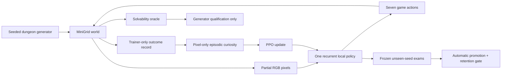

# Architecture

## Separation of responsibilities

- **Game:** owns objects, transitions, rendering, rewards, success, and time limits.
- **Generator:** creates varied layouts and rejects any layout that violates the tier's reachability
  constraints.
- **Oracle:** proves a complete legal action sequence exists. It does not teach.
- **Policy:** receives pixels and produces actions.
- **Trainer:** updates the policy from ordinary experience and mixes retained tiers.
- **Curiosity:** counts only policy-visible pixel views within one episode; it is absent from exams.
- **Evaluator:** freezes updates, resets recurrent state between episodes, and grades held-out seeds.
- **Run supervisor:** writes manifests, heartbeats, checkpoints, frames, and terminal reasons.
- **Dashboard:** displays evidence but cannot change the run.

## Expansion boundary

New objects implement a small mechanic interface: placement constraints, transition behavior,
rendering, and oracle validation. The observation shape and seven-action vocabulary remain stable
where possible so old checkpoints can be evaluated after the game expands.

The generator must provide a mechanical proof of solvability before a new mechanic enters training.
The evaluator must add both an isolated mechanic suite and at least one composed suite. A model is
never credited merely because the archive or oracle can solve a level.
