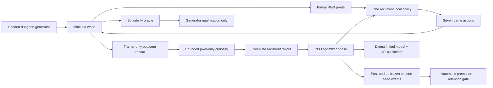
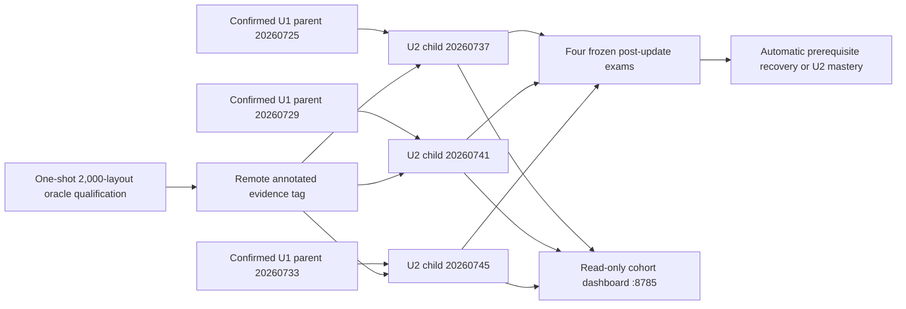
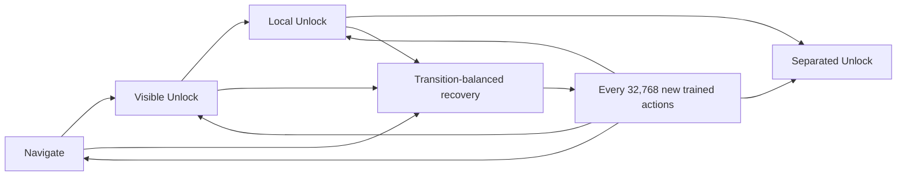
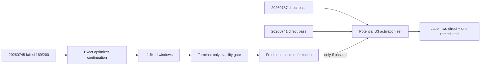
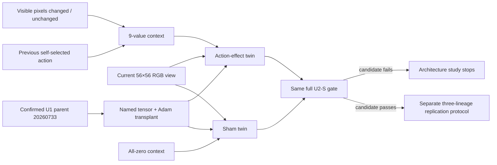
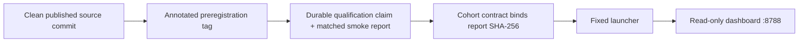

# Architecture



## Separation of responsibilities

- **Game:** owns objects, transitions, rendering, rewards, success, and time limits.
- **Generator:** creates varied layouts and rejects any layout that violates the tier's reachability
  constraints.
- **Oracle:** proves a complete legal action sequence exists. It does not teach.
- **Policy:** receives pixels and produces actions.
- **Trainer:** updates the policy from ordinary experience and mixes retained tiers.
- **Curiosity:** pays only for novel policy-visible pixel views, has a hard episodic budget, and is
  absent from exams.
- **Evaluator:** freezes updates, resets recurrent state between episodes, and grades held-out seeds.
- **Run supervisor:** separates collected from trained timesteps and writes manifests, heartbeats,
  checkpoint bundles, frames, and terminal reasons after optimizer boundaries.
- **Dashboard:** displays evidence but cannot change the run.

## Present expansion boundary

Protocol v0.1 deliberately implements only three tiers. Their generation, reward, oracle recipe,
evaluation loop, and promotion order are still encoded in tier-specific branches. That is adequate
for the first learnability experiment, but it is not yet a plug-in mechanics architecture. Adding a
lever or enemy today would require coordinated edits across those components.

The completed v0.1 canaries also showed that episode-weighted practice does not control experience
when tier horizons differ: a nominal 30% Navigate episode share became only 4–6% of post-promotion
transitions. The proposed [v0.2 protocol](protocol-v0.2-design.md) introduces a declarative lesson
layer and a transition-deficit sampler before any new mechanic is added.

Before the first mechanics expansion, the framework will introduce declarative `MechanicSpec` and
`TaskSpec` registries, success predicates, procedural blueprints, and a capability dependency graph.
Each new mechanic must bring:

- placement and transition rules;
- a mechanical solvability proof;
- an isolated unseen-seed evaluation suite;
- at least one composed suite with earlier mechanics;
- a stable policy-visible objective representation if two tasks can share the same scene.

The observation shape and seven-action vocabulary should remain stable where practical so old
checkpoints can still be evaluated. A model is never credited merely because the generator or oracle
can solve a level.

## U2 cumulative lineage boundary

U2 is the first expansion built from three independently confirmed cumulative parents rather than
one selected development checkpoint. There is no policy merge and no cross-lineage replay:



The children execute sequentially on the audited 8 GB M1, but the dashboard presents all three
lineage states from one small cohort manifest. It reads each lineage's atomic status and frame files;
it cannot choose an action, update a policy, or stop a trainer when the browser closes.

The new environment changes geometry and distance, not the agent interface. A complete divider has
one locked-door crossing, the key and start are on the approach side, the goal is beyond it, and
exactly two extra interior walls create a longer 17–26-action qualified route. The policy still sees
the same partial RGB pixels, carries the same 256-unit recurrent state, and emits the same seven
actions. PPO, reward, curiosity, and inherited optimizer state are unchanged.

The trainer now maintains a four-lesson capability graph:



A prerequisite miss resets the U2 mastery streak and changes only future practice allocation. It
does not roll weights back, change reward, or lower a gate. Exams occur after optimization and name
the exact archive digest they score, so dashboard state can never substitute for checkpoint state.
Every completed 2,048-action optimizer phase also replaces one bounded `latest-safe` archive,
sidecar, and integrity record. An interruption may discard incomplete work, but it cannot erase or
double-charge a completed update; a resumed lineage continues in a new manifest segment.

Seed roles are architectural boundaries as well as numbers. Training uses the sub-million
partition; generator engineering has a disposable `5_200_000` sandbox; sealed qualification uses
`5_210_000`–`5_211_999`; and four fixed validation suites occupy their declared 10–11.2-million
blocks. At the U2 source freeze, four 15.2-million candidate streams were reserved for the later
collision-aware confirmation, while the 20-million final allocation remained untouched.
Exact-layout hashes defend against the lesson learned from U1 confirmation attempt 1: different seed
numbers can still generate the same dungeon.

Storage is part of correctness. U2 refuses symlinked or escaping run paths, caps each lineage at
2 GiB and the scientific cohort at 6 GiB, keeps optional media in a separate 10 GiB directory, and
checks a 16 GiB combined plan plus the free-space reserve. At U2 source freeze, no protected U2
seed had been opened and no U2 learning or confirmation claim existed. Later runtime claims cite
the external qualification, cohort, and confirmation ledgers rather than rewriting that prospective
boundary.

## U2r successor boundary

Runtime evidence has now answered the original U2 confirmation: two children passed, while child
`20260745` scored 169/200 against its 170/200 U2 gate. That immutable 2/3 failure does not disappear
from the architecture. [U2r Stability Remediation](protocol-v0.2-u2r-stability-remediation.md)
adds one bounded successor branch:



Only the failed branch changes. It cannot load either passing sibling, reset its optimizer, select
an intermediate checkpoint, exceed the original 1,048,576-child-action ceiling, or inspect a fresh
confirmation candidate while training. The last two fixed exams must pass both the original
capability gates and the new prospective stability diagnostics.

Process recovery is an append-only lineage rather than an overwrite. The initial directory has the
fixed child name; contiguous successors use `-resume-N`, add `N × 100,000` to their process RNG
streams, and authenticate the prior safe checkpoint plus policy/optimizer state. Completed exams
and their 320 raw case records are copied and reverified in every successor. The four genuinely
active episodes at interruption are preserved as abandoned identities, while a terminal report
hashes every segment manifest and episode-start ledger so later collision exclusion covers the
whole lineage.

The consumed `15_200_000`–`15_239_999` confirmation roles are permanently unavailable for
successor training, retries, or new selection; claim-bound historical verifier access remains so
the frozen result can still be authenticated. Four new structurally sealed roles occupy
`15_240_000`–`15_279_999`, but only a full-budget terminal-eligible U2r artifact can authorize
their one-shot evaluator. The `20_000_000` final
allocation remains closed. Episode-start and active-worker layout identity now become part of every
checkpoint record so a future collision-aware selector can exclude the complete successor history,
including episodes active at the terminal boundary.

## v0.3 action-effect architecture boundary

U2-S completed without an eligible reward/PPO configuration. Its four cells made the missing
relationship unusually clear: strong updates could learn capability but occasionally collapse into
hundred-action interaction loops; conservative updates could suppress those loops only by losing
capability; pixels-only negative feedback narrowed but did not close the gap. v0.3 therefore changes
the policy input architecture while holding reward and PPO fixed.



The vector is retrospective sensorimotor context, not a game hint. Seven coordinates identify the
policy's own immediately preceding primitive action. Two identify whether the next visible RGB
bytes changed or remained identical. Episode start is all zero. The wrapper never reads reward,
coordinates, inventory, objects, milestones, seed roles, oracle state, or trainer-only `info`.

The custom extractor directly subclasses the existing NatureCNN. Its inherited `cnn` and `linear`
parameter names and 512-feature output therefore remain unchanged. One new bias-free `9 → 512`
linear projection is added as a residual before the existing actor and critic LSTMs. It is zeroed
after complete policy construction, and the policy disables the default post-LSTM multilayer head:

```text
image ── NatureCNN (inherited) ── 512 features ──┐
                                                ├─ add ─ actor/critic LSTMs ─ heads
context ── zero-initialized 9→512 projection ───┘
```

Every old CNN, LSTM, action-head, and value-head tensor is copied by exact state-dict name and shape.
Every old Adam state is joined to its new parameter by that same name; positional optimizer loading
is forbidden because inserting one parameter would otherwise shift moment ownership. The new
projection begins with no Adam state. Its zero output makes the migrated policy exactly equivalent
to the parent at the boundary even though the archive now has a Dict observation space.

That equivalence is executable, not rhetorical. Qualification must compare visual features,
deterministic actions, values, log probabilities, and both recurrent-state branches on a fixed
pixel corpus. The two arms must then produce byte-identical action/environment evidence over their
first real 2,048-transition rollout. Only the subsequent PPO phase may use the nonzero candidate
context to change the projection and create behavioral divergence.

The study remains deliberately narrow:

- both twins restart from confirmed U1, never from U2, U2r, or U2-S;
- reward, curiosity, curriculum, horizon, PPO, worker streams, action budget, and exams are matched;
- the complete U2-S final-three capability-and-stability gate is reused without relaxation;
- sham is calibration and cannot be selected;
- a passing candidate selects only the architecture definition, never its development checkpoint;
- Stage A is non-resumable, and an interruption requires a new frozen attempt for both twins; and
- U3 remains closed until a later three-parent replication and untouched confirmation both pass.

This boundary also prepares the eventual party-management game. A shared local policy must know not
only what an adventurer sees, but what that adventurer just attempted and whether the world visibly
responded. Because the context is per-agent and contains no class or objective shortcut, the same
weights can later be evaluated independently for several party members while their equipment,
class, local view, and higher-level tactics remain explicit future mechanics.

The release machinery for that boundary is now implemented but not yet exercised canonically:



The tag `action-effect-architecture-v0.3-stage-a-20260724` binds the source, protocol, roots,
architecture and runtime contracts; it cannot contain a report generated later. The qualification
root then binds that tag object, and the cohort manifest binds the qualification report. The only
launcher is `scripts/run_v03_action_effect_stage_a.sh`; its assigned cohort and media roots are
`/Volumes/T7 Developer/DungeonApprentice/v03-action-effect-stage-a-20260724` and
`/Volumes/T7 Developer/DungeonApprentice/v03-action-effect-stage-a-media-20260724`. None of those
canonical artifacts exists while the current source remains unfrozen.
