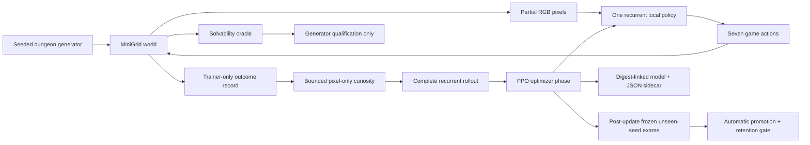

# Architecture

## Separation of responsibilities

- **Game:** owns objects, transitions, rendering, rewards, success, and time limits.
- **Generator:** creates varied layouts and rejects any layout that violates the tier's reachability
  constraints.
- **Oracle:** proves a complete legal action sequence exists. It does not teach.
- **Policy:** receives pixels and produces actions.
- **Trainer:** updates the policy from ordinary experience and mixes retained tiers.
- **Curiosity:** pays only for novel policy-visible pixel views, has a hard episodic budget, and is
  absent from exams.
- **Evaluator:** freezes updates, resets recurrent state between episodes, and grades held-out seeds.
- **Run supervisor:** separates collected from trained timesteps and writes manifests, heartbeats,
  checkpoint bundles, frames, and terminal reasons after optimizer boundaries.
- **Dashboard:** displays evidence but cannot change the run.

## Present expansion boundary

Protocol v0.1 deliberately implements only three tiers. Their generation, reward, oracle recipe,
evaluation loop, and promotion order are still encoded in tier-specific branches. That is adequate
for the first learnability experiment, but it is not yet a plug-in mechanics architecture. Adding a
lever or enemy today would require coordinated edits across those components.

Before the first mechanics expansion, the framework will introduce declarative `MechanicSpec` and
`TaskSpec` registries, success predicates, procedural blueprints, and a capability dependency graph.
Each new mechanic must bring:

- placement and transition rules;
- a mechanical solvability proof;
- an isolated unseen-seed evaluation suite;
- at least one composed suite with earlier mechanics;
- a stable policy-visible objective representation if two tasks can share the same scene.

The observation shape and seven-action vocabulary should remain stable where practical so old
checkpoints can still be evaluated. A model is never credited merely because the generator or oracle
can solve a level.
