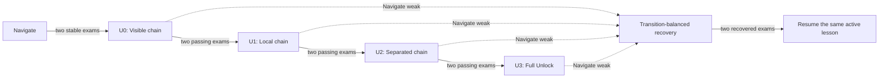

# Proposed protocol v0.2: the Unlock staircase

> Status: partially implemented. The U0 Visible Unlock development slice has been implemented and
> replicated; U1–U3 and the complete protocol remain proposed until their own code, qualification,
> tests, and preregistration are frozen.

## Experimental question

Can an automatically paced difficulty curriculum convert rare stochastic interaction discoveries
into a stable deterministic Unlock skill while retaining learned navigation—without demonstrations,
savestates, intermediate authored rewards, coordinates, mission text, oracle actions, or online
model calls?

Protocol v0.1 answered the first question positively: all three fresh agents learned Navigate. It
also localized the next failure. Frozen Unlock evaluation remained at 0/120, and only 23 of 978
stochastic Unlock attempts opened a door. Meanwhile, an episode-count sampler intended to reserve
30% of practice for Navigate produced only 4–6% Navigate transitions because successful Navigate
episodes were far shorter than failed Unlock episodes.

The v0.2 hypothesis is that the policy does not need a walkthrough. It needs frequent complete
successes on easier procedural versions of the same quest and a measured transition budget that
actually protects its earlier skill.

Retrieve is deliberately outside the v0.2 capability claim. The second rung must become stable
before a third rung is added.

## Falsifiable hypotheses

- **H1 — fragile promotion:** one 40-layout exam can catch a transient peak rather than stable
  Navigate competence.
- **H2 — transition imbalance:** episode-count sampling caused the intended 30% rehearsal share to
  collapse to 4–6% of actual experience.
- **H3 — discovery cliff:** complete Unlock can be learned if successes first become common in
  procedurally easier but still end-to-end quests.
- **H4 — ordered interaction:** the main reusable sequence gap lies between obtaining the key and
  opening the door, not after the door is open.
- **H5 — honest negative result:** if balanced transitions and staged geometry fail, sparse terminal
  reward is insufficient for this declared learner and budget; reward shaping or auxiliary learning
  becomes a separately declared study.

## What remains frozen

To make v0.1 and v0.2 interpretable as a curriculum comparison, v0.2 retains:

- a randomly initialized policy for every run;
- the 56 × 56 × 3 partial RGB observation and recurrent state only;
- the same seven actions;
- the same convolutional encoder, 256-unit LSTM, and action/value heads;
- recurrent PPO with four workers, 512-step rollouts, batch 256, four epochs, learning rate
  0.00025, gamma 0.995, GAE lambda 0.98, and entropy coefficient 0.01;
- success reward +1.0 and ordinary step reward -0.001;
- pixel-novelty curiosity of +0.002 with a hard 0.1 episodic budget, disabled during exams;
- post-optimizer evaluation and digest-linked checkpoint publication;
- deterministic frozen evaluation as the only promotion authority;
- normal episode starts from newly generated layouts;
- no imported trajectories, oracle decisions, action masks, objective text, task cue, coordinates,
  full map, pretrained model, or LLM decision.

V0.2 does **not** pay for picking up a key, opening a door, approaching an object, or following an
oracle path. Those events remain diagnostics. This successor isolates curriculum geometry and
transition-balanced rehearsal. If sparse terminal reward still fails, a bounded shaping experiment
will be a new protocol rather than an unrecorded mid-run adjustment.

## Why lessons are not new pseudo-tiers

`DungeonTier` currently combines mechanics, generation, evaluation, promotion order, and UI. Adding
`Key`, `Door`, or `Easy Unlock` as more enum values would make that coupling worse. V0.2 adds a
declarative `TaskSpec` or `LessonSpec` layer above the existing canonical tiers.

Each lesson specification contains:

- a stable string ID and display label;
- its canonical capability (`Navigate` or `Unlock`);
- explicit prerequisites;
- a generator profile and maximum horizon;
- a disjoint validation-seed slot;
- its frozen transition target;
- the unchanged full-quest success predicate;
- oracle and qualification requirements.

The prerequisite graph is explicit even though v0.2 is linear. Future mechanics can branch and
compose without pretending every capability belongs in one integer sequence.

## The difficulty staircase

Every Unlock lesson begins with the agent in an ordinary generated dungeon with no inventory. Every
lesson requires the complete sequence: acquire the matching key, open the locked door, and reach the
green exit. The policy is not told which lesson generated the scene. Only problem frequency and
geometry change.

| Lesson ID | Name | Frozen generator profile | Horizon |
| --- | --- | --- | ---: |
| `navigate/full` | Navigate | Exact v0.1 Navigate distribution | 128 |
| `unlock/u0-visible` | Visible chain | 9 × 9; no extra walls; key and door initially visible; oracle solution 5–10 actions | 128 |
| `unlock/u1-local` | Local chain | 9 × 9; no extra walls; key initially visible; oracle solution 9–18 actions | 128 |
| `unlock/u2-separated` | Separated chain | 9 × 9; two extra walls; no visibility guarantee; oracle solution 17–26 actions | 160 |
| `unlock/u3-full` | Full Unlock | Exact v0.1 Unlock distribution: five extra walls and unrestricted valid solution length | 256 |

Rotation, reflection, agent orientation, key color, spacing, and valid wall placement still vary by
seed. The easier lessons must not collapse into one memorized action tape. Layout hashes include the
lesson ID and generator profile.

Keeping the same complete success predicate matters. If one visually identical scene ended when a
key was picked up while another continued to the exit, the recurrent critic would receive conflicting
terminal and value targets unless the objective were visibly cued. V0.2 avoids that alias instead of
quietly adding a task label. Any future milestone-terminal lesson must add an explicit policy-visible
objective contract and therefore declare another observation protocol.

The 128-step minimum is a reward invariant, not accidental generosity. With ordinary cost -0.001
and curiosity capped at 0.1, even a maximally novel failed timeout has negative undiscounted combined
return (`0.1 - 0.128 = -0.028`). Before release, reward tests must cover every lesson horizon and
prove both negative timeout return and discounted dominance of the latest possible success at gamma
0.995. A shorter staged horizon would require a new curiosity budget rather than silently making
failure profitable again.

Before training, the qualification oracle must solve 1,000 unique layouts from each of the five
lessons: 5,000/5,000 successes, no duplicate hashes within a lesson, all solution-length and
visibility constraints satisfied, and no lesson metadata present in policy observations.

## Transition-balanced practice

V0.1 chose a tier when an episode reset. That is statistically wrong for tasks with different
horizons: a 30-step Navigate success and a 256-step Unlock timeout each counted as one sample.

V0.2 targets **transitions**, not episode counts. A shared deficit scheduler records actual actions
collected for every eligible lesson. When a worker needs a new episode, it assigns the lesson furthest
below its cumulative target. Tasks never change inside an episode. Across each 32,768-action window,
the realized share for every lesson must remain within five percentage points of its declared target
or the run is operationally invalid.

This scheme remains compatible with complete recurrent episodes and unequal horizons. It must be
tested for deterministic sampling, resume fidelity, and simultaneous worker resets. A future move
from in-process `DummyVecEnv` to subprocess workers will require an explicit shared scheduler rather
than silently copying its state.

## Automatic practice and recovery

Evaluation occurs after every 32,768 trained actions. Each exam contains 80 deterministic layouts,
split into two frozen 40-layout panels. Panel requirements prevent one favorable half of the suite
from producing a lucky transition.

### Stable Navigate

Navigate becomes stable only after two consecutive exams, separated by a complete training
interval, with all of the following:

- at least 72/80 overall success (90%);
- at least 34/40 success (85%) in each panel.

### Unlock-stage advancement

U0, U1, and U2 advance only after two consecutive exams with:

- at least 68/80 active-stage success (85%);
- at least 32/40 success (80%) in each active-stage panel;
- at least 68/80 Navigate retention (85%).

Full Unlock mastery requires two consecutive exams with:

- at least 72/80 U3 success (90%);
- at least 34/40 success (85%) in each U3 panel;
- at least 68/80 Navigate retention (85%).

At most one transition may occur at a trained boundary. Promotion saves a permanent checkpoint; a
failure never silently rolls the policy back or advances it.

### Frozen transition targets

Before stable Navigate, training uses Navigate only. At U0 it uses 50% Navigate transitions and 50%
U0 transitions. At U1, U2, and U3 it uses:

| Practice source | Target share of transitions |
| --- | ---: |
| Navigate | 50% |
| Active Unlock lesson | 35% |
| Previously passed Unlock lessons, uniformly | 15% |

If a frozen Navigate exam falls below 68/80, stage advancement freezes and the next interval targets
75% Navigate and 25% active Unlock transitions. Normal practice resumes only after two consecutive
Navigate exams recover to at least 68/80. The active lesson is never changed by a dashboard
observation or training reward.

This controller converts retention failure into more relevant experience. Protocol v0.1 merely
noticed a weak earlier skill while continuing the same episode-sampling rule.

## Seed separation

The implementation must validate that no range overlaps another range or the training partition.

| Purpose | Frozen allocation |
| --- | --- |
| Training | Below 1,000,000 |
| Navigate validation panel A | 10,000,000–10,000,039 |
| Navigate validation panel B | 10,000,040–10,000,079 |
| U0 validation | 11,000,000–11,000,079 |
| U1 validation | 11,100,000–11,100,079 |
| U2 validation | 11,200,000–11,200,079 |
| U3 validation | 10,100,000–10,100,079 |
| Post-training Navigate confirmation | 15,000,000–15,000,199 |
| Post-training U0 confirmation | 15,010,000–15,010,199 |
| Post-training U3 confirmation | 15,100,000–15,100,199 |
| Complete-project untouched final allocations | 20,000,000–20,299,999 |
| Consumed uniform-random diagnostic; never use for claims | 30,000,000–30,000,199 |

The confirmation partition is opened only after a checkpoint is selected and frozen. The declared
20-million final allocations remain untouched for the eventual complete Navigate–Unlock–Retrieve
curriculum. The recorded 30-million diagnostic block is permanently excluded rather than quietly
being presented later as unseen.

## Evidence and telemetry

The dashboard and append-only records organize outcomes by lesson rather than only canonical tier.
They report:

- current lesson, time and trained actions in that lesson;
- target and realized transition shares for the current 32,768-action window;
- whether retention recovery is active;
- consecutive qualifying-exam count;
- deterministic success count and Wilson 95% interval for both panels and their union;
- Navigate retention at every post-promotion boundary;
- key acquisition, door opening, and quest completion rates;
- `door_given_key` and `success_given_door` conversion rates;
- deterministic frozen success and a separately labeled replicated stochastic diagnostic;
- trailing stochastic-training success versus deterministic-exam success;
- action histogram, largest action share, and longest repeated-action run;
- collisions per action, ineffective interactions per interaction action, reachable-cell coverage,
  and successful-path actions divided by oracle actions;
- extrinsic return and curiosity return separately;
- PPO entropy, approximate KL, clip fraction, explained variance, policy loss, value loss, trained
  actions, and optimizer updates.

Deterministic evaluation remains the promotion authority. Stochastic frozen evaluation explains
whether the policy distribution contains a fragile behavior; it never silently replaces the declared
success measure.

Counts remain primary; rounded percentages are presentation. Thousands of episodes from one policy
are not treated as independent replications. The report gives each seed separately and summarizes
the three seeds with median, minimum, and maximum.

The dashboard adds a lesson staircase, target-versus-realized practice panel, retention warning, and
visual key → door → exit funnel. These are read-only views of recorded state.

## Development and confirmatory sequence

### 1. Engineering acceptance

- Add the declarative lesson registry, generator profiles, task-specific seed allocation, oracle,
  transition-deficit sampler, promotion state, checkpoint schema, evaluator, and dashboard fields.
- Keep v0.1 artifacts readable from their recorded source commit; v0.1 checkpoints cannot resume
  under v0.2.
- Pass unit tests, lint, reward invariants, 5,000-layout qualification, train-save-resume-evaluate,
  deliberate-interruption recovery, and transition-allocation tests.
- Use a short forced-stage smoke only to prove every lesson can be sampled and recorded. It is not
  capability evidence.

### 2. Development sentinel

Run one 524,288-action fresh seed, `20260725`, to check that the controller behaves and that U0
produces a measurable door-learning signal. This run may motivate code fixes or a successor design
and is not pooled with confirmation. Freeze all behavior-affecting choices after this phase.

### 3. Preregistered three-seed run

Use paired algorithm seeds `20260722`, `20260723`, and `20260724` so the v0.1/v0.2 comparison does
not select only a favorable initialization. Every policy starts from random parameters; no v0.1
checkpoint is resumed.

Per seed:

- maximum 1,048,576 trained actions;
- evaluation and checkpoint every 32,768 trained actions;
- 80 validation layouts per evaluated lesson;
- early stop only after the complete two-exam U3 mastery criterion;
- no manual stop because a curve looks encouraging or discouraging;
- same-protocol resume only, with the original cumulative budget preserved.

The three runs execute sequentially with one CPU trainer on the audited 8 GB M1. The maximum is
3,145,728 training actions, approximately 6–8 hours including exams, and roughly 1–2 GiB of new
artifacts. The T7 run root retains the existing 25 GiB free-space safety margin.

### 4. Frozen confirmation

For each run that qualifies, select the **first** checkpoint satisfying the two consecutive U3
gates—not a later best-looking checkpoint. Evaluate every selected checkpoint once on 200 new
Navigate and 200 new U3 confirmation layouts. Confirmation never changes a policy or curriculum.

## Preregistered outcomes

Per-run mastery requires:

- two consecutive U3 validation exams at 72/80 or better;
- Navigate at 68/80 or better at both boundaries;
- realized transition shares within five percentage points of target in every training window;
- post-training confirmation of at least 180/200 U3 and 170/200 Navigate.

Project-level interpretation:

| Outcome | Frozen definition |
| --- | --- |
| Pass | At least 2/3 seeds satisfy per-run mastery and confirmation |
| Strong replication | 3/3 seeds pass |
| Partial | At least 2/3 reach U3 or exceed 50% U3, but fewer than two master it |
| Interaction failure | Fewer than 2/3 pass U1 |
| Transfer failure | Easier stages pass, but fewer than 2/3 reach 90% on U3 |
| Retention failure | Unlock reaches threshold while Navigate falls below 85% |
| Replication failure | Only one seed succeeds |
| Allocation failure | Any declared practice window misses a transition target by over five points |

Milestone improvement never substitutes for complete quest success.

## Diagnostic labels

The maximum budget still runs unless an engineering fault or the mastery condition stops it. The
following labels explain a negative result after the run; they do not authorize an improvised tweak:

- **interaction inaccessible:** U0 remains below 25% after 262,144 total actions;
- **sequence bottleneck:** keys exceed 50% but `door_given_key` remains below 10%;
- **transfer cliff:** U0/U1 pass while U3 remains below 25% after 262,144 actions of U3 exposure;
- **retention controller failure:** Navigate remains below 85% for two exams during recovery;
- **determinization gap:** trailing stochastic training exceeds deterministic exam success by more
  than 30 percentage points;
- **optimization fault:** collapsed entropy, pathological action dominance, or invalid checkpoint
  state explains behavior before the learning hypothesis can be judged.

If sparse terminal reward fails under this staircase for the declared learner and budget, the next
proposal may compare it with potential-based milestone shaping or auxiliary representation learning.
Either change receives a new protocol identifier, fresh random runs, new reward tests, and its own
preregistration.

## Deviation policy

- Freeze the source commit, registry hash, commands, seeds, and storage path before seed one.
- Do not alter v0.2 after inspecting the first confirmatory seed.
- A behavior-affecting defect invalidates and restarts all confirmatory runs.
- A telemetry-only defect may be annotated only when policy, environment, RNG, and checkpoint hashes
  remain unchanged.
- Record every deviation with a timestamp before continuing.
- Never consult confirmation or final seeds to choose a hyperparameter.

## Implementation order

1. Add the lesson registry and disjoint seed contracts without changing policy observation/action
   shapes.
2. Add and qualify the three simplified Unlock generators while preserving the complete success
   predicate.
3. Generalize evaluation and the oracle from integer-tier order to explicit lesson prerequisites.
4. Replace episode sampling with a transition-deficit scheduler; persist its targets, counts, active
   lesson, and recovery state in checkpoint sidecars.
5. Add stable-pass counters, per-lesson exposure, interaction funnels, action diagnostics, and
   target-versus-realized shares to artifacts and the dashboard.
6. Test fresh training, allocation, promotion, recovery, resume, interruption, and protocol
   incompatibility.
7. Freeze and preregister the development sentinel command only after engineering acceptance.

The implementation is not ready to train merely because it imports. The acceptance boundary is a
fully qualified, resumable, observable controller whose exams still grade only complete behavior.

## Narrative

The central story is no longer “can random actions find an exit?” It is:

1. **The first real success:** three agents independently learned to navigate.
2. **The ladder collapsed:** all three finished at exactly 75% retention.
3. **The hidden imbalance:** a promised 30% rehearsal share was only 4–6% of actual experience.
4. **The interaction clue:** only 4.3% of key episodes became door openings.
5. **The new hypothesis:** the agent needs abundant complete early practice, not a walkthrough.
6. **The fair comparison:** same pixels, model, rewards, and algorithm seeds; only the automatic
   curriculum changes.
7. **The honest endings:** stable Unlock, partial sequence learning, transfer failure, retention
   failure, or evidence that sparse terminal reward is insufficient for this learner and budget.

That makes either success or failure informative—and gives the next iteration one question rather
than another pile of emergency patches.
