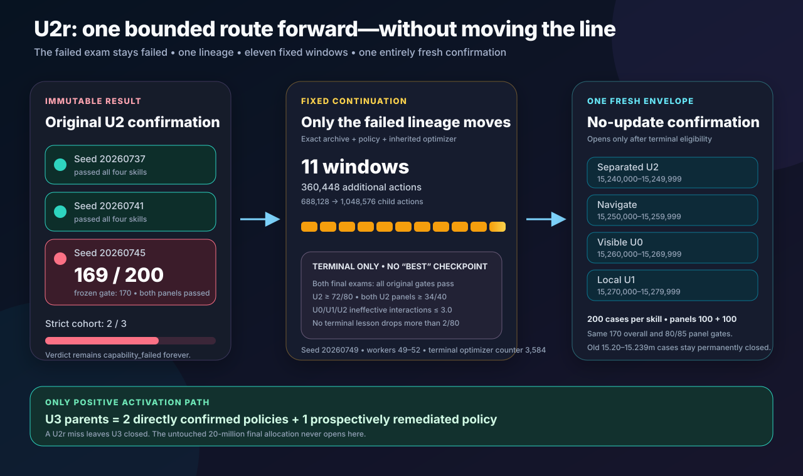

# Protocol v0.2 U2R: Stability Remediation

> **Status:** original launch attempt 1 is an immutable zero-action operational failure. Amendment
> r1 is frozen below and has passed implementation qualification; policy training has not begun.
> No fresh `15_240_000`–`15_279_999` confirmation candidate has been opened.

The original clean source and annotated tag `u2r-stability-v0.2-u2r-20260723` remain the immutable
preregistration for attempt 1. They are not moved to r1. The exact launch evidence and checksums are
preserved in the
[attempt-1 result](results/v0.2-u2r-launch-attempt-1.md).

## Launch attempt 1 and controlling r1 amendment

Attempt 1 started at `2026-07-23T15:38:06+00:00` and stopped at
`2026-07-23T15:38:10+00:00` while Stable-Baselines3 was resetting its initial vector environment.
It performed **zero policy actions, zero remediation actions, and zero optimizer updates**. One
zero-step U1 episode start was logged; the next worker then proposed 128 excluded U0 layouts and
hit the fixed rejection ceiling. No checkpoint, evaluation, interruption record, terminal report,
or resumable state exists.

The original rule had applied one 84,218-layout historical union to all four training lessons.
Visible Unlock U0 has a finite 2,800-layout exact domain. Of those, 2,774 appeared in the original
guard, leaving only 26. Attempt 1 therefore revealed an infeasible training-distribution rule,
not a policy-learning result.

The old root
`/Volumes/T7 Developer/DungeonApprentice/u2r-stability-20260723`, its empty media root, and tag
`u2r-stability-v0.2-u2r-20260723` are immutable failed-attempt evidence. They may not be resumed,
rewritten, deleted, or reused.

The prospective amendment has these independent identities:

| Field | r1 value |
| --- | --- |
| Protocol | `dungeon-apprentice-v0.2-u2r-stability-r1` |
| Annotated tag | `u2r-stability-v0.2-u2r-r1-20260723` |
| Run root | `/Volumes/T7 Developer/DungeonApprentice/u2r-stability-r1-20260723` |
| Media root | `/Volumes/T7 Developer/DungeonApprentice/u2r-stability-r1-media-20260723` |
| Initial segment | `v02-u2r-r1-seed-20260745` |
| Dashboard port | `8786` |

r1 changes only the finite-U0 training exclusion rule and the evidence identities required to keep
the two launches separate. It retains the same parent and optimizer, algorithm seed `20260749`,
worker streams `20260749`–`20260752`, action budget, learner, reward, curriculum, development
exams, terminal-only stability gates, and still-sealed confirmation streams. Because attempt 1
never reached a policy action or update, these seeds do not encode a repeated learning outcome.

For any conflict between the original prospective wording below and this amendment, this section
controls r1. Everything not explicitly amended remains frozen.

## Decision in one sentence

Continue exactly the one U2 lineage that missed confirmation, with its complete optimizer state and
only the **360,448 actions left under its original U2 ceiling**; select only its full-budget terminal
artifact; require a prospectively stricter two-exam stability gate; and give that new artifact one
no-update confirmation on entirely fresh streams.

This is a bounded successor experiment. It is not a rerun of U2 confirmation, not a threshold
change, not a replacement fourth lineage, and not U3.

## Evidence that cannot change

The original U2 result remains two different things at once:

- **development replication:** three of three U2 children reached the frozen adjacent-exam mastery
  rule; and
- **post-training confirmation:** two of three selected policies passed every gate, so the frozen
  strict cohort verdict is **`capability_failed`**.

The canonical confirmation report is:

- protocol: `dungeon-apprentice-v0.2-u2-confirmation`;
- attempt: `u2-confirmation-v0.2-u2-20260723-attempt-1`;
- completed: July 23, 2026 at 13:05:30 UTC;
- report:
  `/Volumes/T7 Developer/DungeonApprentice/confirmations/v0.2-u2-20260723/report.json`;
- report SHA-256:
  `7522eb8742ed567577d1f02a2a9960d698981044128e0866daa262d36aaf1c69`;
- policy updates during confirmation: none; and
- verdict: `capability_failed`.

The three frozen policy results were:

| U2 child | Navigate | Visible U0 | Local U1 | Separated U2 | Original result |
| ---: | ---: | ---: | ---: | ---: | --- |
| `20260737` | 193/200 | 200/200 | 200/200 | 184/200 | Passed |
| `20260741` | 188/200 | 200/200 | 200/200 | 188/200 | Passed |
| `20260745` | 190/200 | 188/200 | 196/200 | **169/200** | Failed U2 overall by 1 |

Child `20260745` passed both U2 panels at 84/100 and 85/100. That does not replace the frozen
170/200 overall requirement. The score cannot be rounded, pooled with another policy, regraded
under a confidence interval, or overwritten by a later result. Even if U2R succeeds, the historical
sentence remains:

> The original U2 confirmation passed two policies out of three and failed its preregistered
> all-three rule.

## Why this successor exists

The one-case miss is compatible with ordinary fixed-exam variation: if a policy's true success
probability were exactly 0.85, a Binomial(200, 0.85) exam would produce 169 or fewer successes about
45.15% of the time. That observation explains why the result is not a collapse. It does not convert
169 into a pass.

The more actionable evidence is a stability regression already visible before confirmation. For
child `20260745`, the final 32,768-action U2 window changed the same frozen development exams as
follows:

| Lesson | First pass at 655,360 | Selected mastery at 688,128 | Mean ineffective interactions, first → mastery | Interaction action count, first → mastery |
| --- | ---: | ---: | ---: | ---: |
| Navigate | 80/80 | 79/80 | 0.225 → 0.025 | diagnostic only |
| Visible U0 | 80/80 | 76/80 | 0.000 → 6.550 | 80 → 600 toggles |
| Local U1 | 80/80 | 77/80 | 0.038 → 4.738 | 83 → 456 toggles |
| Separated U2 | 76/80 | 72/80 | 2.488 → 6.538 | 238 → 554 toggles |

The selected checkpoint still passed every original development gate, but its deterministic policy
had developed broad repeated-interaction loops. Confirmation preserved the phenotype: U2 averaged
5.135 ineffective interactions, reached 188 keys, opened 172 doors, and completed 169 quests.
Completion after an opened door remained 98.26%; the larger leak was between acquiring the key and
opening the door.

This diagnosis motivates a **stability eligibility rule**, not a new reward. U2R does not train on
the 200 opened U2 confirmation cases, imitate an oracle, penalize toggling, add a milestone reward,
or change the practice mixture after seeing the failure.

## Alternatives considered

| Option | Scientific value | Principal weakness | Decision |
| --- | --- | --- | --- |
| Continue the failed lineage under a bounded successor | Preserves the third independent U1 ancestry and directly tests whether more unchanged experience stabilizes it | The resulting policy is remediated, not an original 3/3 confirmation | **Chosen once** |
| Train a fourth U2 child | Adds a prospective training outcome | A child from an existing U1 parent is correlated and yields 3/4 evidence at best; a fresh U0→U2 ancestry is much more expensive | Reserve only if U2R fails |
| Open U3 with the two passing policies | Fastest route to harder maps | Selects only the strongest parents and violates the frozen U2 activation boundary | Rejected for protected U3 work |
| Re-examine the unchanged failed checkpoint | Helps estimate sampling uncertainty | Looks like optional continuation after observing a one-case miss and cannot erase attempt 1 | Rejected as an activation gate |

Hierarchical or beta-binomial analysis may describe uncertainty across policies. It may not pool
policies into a synthetic agent or alter the operational decision.

## Question and claim boundary

The U2R question is:

> Can the exact failed U2 first-mastery policy become deterministically stable after spending only
> the remainder of its already declared U2 action ceiling, with no change to its learner, task,
> reward, or experience mixture, and then pass one fresh collision-aware confirmation?

A positive result supports only:

> Two U2 policies confirmed directly, and one failed lineage later produced a prospectively
> remediated terminal successor that confirmed independently.

It does not turn the original result into 3/3. It does not establish Full Unlock, Retrieve, general
planning, combat, party intelligence, or the untouched project-final distribution.

## Exact sole parent and continuation state

U2R has one legal parent:

| Field | Frozen value |
| --- | --- |
| Original U1 ancestry | U0 `20260727` → U1 `20260733` → U2 `20260745` |
| Parent archive | `/Volumes/T7 Developer/DungeonApprentice/u2-separated-20260723/v02-u2-seed-20260745/checkpoints/mastered-separated-unlock.zip` |
| Parent archive SHA-256 | `56dc459fb94110f41a14b2304425f572fc235c8cfc07e1152306cbf77ac33dee` |
| Parent training source commit | `b7b5d361b0aa2eeabedc435fa0d4b9e1ffdd09db` |
| Parent sidecar SHA-256 | `68cfb84ec3fbfd4204cfa9679d5b8c1fe75b17bdf26d828ed1f92510b439cc29` |
| Parent integrity record SHA-256 | `250ebf0a8fe98ed5370d20c9b55531ec5e1be33df6821fc73b670628ddfb6151` |
| Serialized policy member SHA-256 | `0783c6955ff1d62b87980d7801c8fbaedcb010174d640c4ee0f07f340371b6db` |
| Canonical loaded optimizer-state SHA-256 | `e821dec631c76e32ce3ac2a0fc3aac70ae55dbe4cd625ed29a11b5b35febaba2` |
| Child trained actions at inheritance | 688,128 |
| Inherited pre-U2 actions | 786,432 |
| Lifetime trained actions at inheritance | 1,474,560 |
| U2 optimizer-update counter at inheritance | 2,880 |
| U2R continuation algorithm seed | `20260749` |
| Four U2R worker streams | `20260749`–`20260752` |

Attempt 1 used protocol ID `dungeon-apprentice-v0.2-u2r-stability`. Its immutable failed
scientific run is:

`/Volumes/T7 Developer/DungeonApprentice/u2r-stability-20260723/v02-u2r-seed-20260745`

Its fixed annotated preregistration tag is:

`u2r-stability-v0.2-u2r-20260723`

r1 uses protocol ID `dungeon-apprentice-v0.2-u2r-stability-r1` and canonical run:

`/Volumes/T7 Developer/DungeonApprentice/u2r-stability-r1-20260723/v02-u2r-r1-seed-20260745`

Its new annotated preregistration tag must be
`u2r-stability-v0.2-u2r-r1-20260723`. The clean committed r1 implementation and external annotated
tag must bind the amended document before the new run directory can be created. r1 is not qualified
merely because attempt 1's implementation qualified.

The archive must load as a complete recurrent-PPO checkpoint with its optimizer. A weights-only
export, the earlier 655,360-action first-pass checkpoint, `latest-safe`, `terminal`, a later manual
copy, a passing sibling, or a newly initialized optimizer is prohibited.

Before update one, the runner must reproduce the exact parent counters, policy tensor digest,
optimizer-state digest, curriculum state, transition allocation state, and deterministic
development results. Any mismatch is an integrity failure, not permission to choose another
artifact.

## What remains unchanged

U2R continues the same learner rather than introducing a behavioral fix:

- the `56 × 56 × 3` egocentric partial RGB image and private recurrent state are the only policy
  inputs;
- the action space remains seven primitive MiniGrid actions;
- the Navigate, U0, U1, and U2 generators, horizons, mechanics, termination, and success conditions
  remain byte-compatible with U2;
- recurrent PPO remains on CPU with four workers, 512-step rollouts, batch size 256, four epochs,
  learning rate `0.00025`, gamma `0.995`, GAE lambda `0.98`, and entropy coefficient `0.01`;
- success reward remains `+1.0`, the ordinary step reward remains `-0.001`, and bounded
  pixel-novelty curiosity remains `+0.002` with a hard 0.1 episodic cap;
- curiosity remains disabled in every deterministic exam;
- key pickup, door opening, inefficient interaction, and path length remain diagnostics with no
  authored reward;
- timeout remains a terminal failed quest;
- no demonstration, oracle action, replay, walkthrough, savestate, coordinate, map, mission text,
  object label, milestone reward, online model call, or sibling policy is added; and
- training lesson allocation and prerequisite recovery remain exactly the U2 controller.

Normal transition targets remain:

| Navigate | Visible U0 | Local U1 | Separated U2 |
| ---: | ---: | ---: | ---: |
| 50% | 7.5% | 7.5% | 35% |

The existing seven prerequisite weak-set recovery profiles, two-clean-boundary recovery exit, and
five-percentage-point allocation tolerance are unchanged. The confirmation result does not become
a scheduler input. The runner may know that this is the sole declared successor; it may not know
which fresh confirmation cases the policy will later face.

## Fixed action budget and artifact selection

The original U2 ceiling was 1,048,576 new child actions. Child `20260745` stopped after 688,128, so
its unspent remainder is exactly:

`1,048,576 - 688,128 = 360,448 = 11 × 32,768`

U2R trains all eleven complete windows. It may not stop early because an intermediate exam looks
good, extend after a poor result, reset the inherited counter, borrow another lineage's unused
budget, or reopen the broader cohort allowance.

The only artifact eligible for U2R confirmation is the exact terminal checkpoint after:

- **1,048,576 U2 child actions**;
- **1,835,008 lifetime trained actions**; and
- **3,584 cumulative optimizer updates** from the complete inherited optimizer plus every U2R
  update.

The lifetime total and optimizer-update total must be derived and verified mechanically from the
checkpoint rather than copied from a dashboard. No intermediate, first stable, highest scoring,
lowest-interaction, or manually selected checkpoint may replace the terminal artifact.

## Prospective terminal stability eligibility

The final two boundaries are fixed in advance:

- penultimate exam: **1,015,808** U2 child actions; and
- terminal exam: **1,048,576** U2 child actions.

Both exams must follow an allocation-valid normal-practice window. Recovery must be inactive at
both boundaries, and no intervening failure, invalid allocation, or recovery state may be hidden.

Each exam must independently pass the unchanged U2 capability floors:

| Lesson | Overall | Panel A | Panel B |
| --- | ---: | ---: | ---: |
| Navigate | at least 68/80 | at least 34/40 | at least 34/40 |
| Visible Unlock U0 | at least 68/80 | at least 32/40 | at least 32/40 |
| Local Unlock U1 | at least 68/80 | at least 32/40 | at least 32/40 |
| Separated Unlock U2 | at least 68/80 | at least 32/40 | at least 32/40 |

Because this successor is specifically a response to an observed deterministic interaction-loop
regression, both final exams must also satisfy all of these prospectively stronger stability
criteria:

1. Separated Unlock U2 scores at least **72/80** overall;
2. both U2 panels score at least **34/40**;
3. mean ineffective interactions are at most **3.0 per episode** independently on U0, U1, and U2;
4. no lesson's terminal overall count is more than **2/80 lower** than its penultimate count; and
5. every reported count and diagnostic is recomputed from the immutable per-case record.

These stability criteria do not regrade the original U2 run. They are knowingly post-result,
prospectively frozen requirements for a new artifact. Navigate does not receive an ineffective-
interaction ceiling because its task contains no required interaction; its existing success and
panel gates remain binding.

Failure of any capability, panel, allocation, curriculum-state, or stability condition gives the
terminal report verdict `failed` and the terminal artifact kind `terminal_failed`. No confirmation
stream opens, and no earlier U2R checkpoint may be substituted.

## Seed and evidence ledger

### Training and development

U2R training layouts remain inside the existing `0`–`999_999` training allocation. Existing frozen
development suites remain the only training-time exams:

| Lesson | Development suite |
| --- | --- |
| Navigate | `10_000_000`–`10_000_079` |
| Visible Unlock U0 | `11_000_000`–`11_000_079` |
| Local Unlock U1 | `11_100_000`–`11_100_079` |
| Separated Unlock U2 | `11_200_000`–`11_200_079` |

Numerical separation alone is insufficient. Attempt 1 required every U2R training environment to
exact-reject any layout identity present in:

- the original U2 sealed qualification;
- all four development suites;
- every completed logged training history across children `20260737`, `20260741`, and `20260745`;
- every accepted layout and every inspectable layout identity recorded by the completed U2
  confirmation selection journal;
- every prior U0, U1, or U2 confirmation reference that the frozen U2 protocol already protected.

That authenticated union contained 84,218 exact identities. For U0, 2,774 of the generator's 2,800
possible exact layouts were in the union. The 26-layout remainder made the declared rejection
sampler operationally unreliable; the frozen attempt encountered 128 excluded proposals before
policy action one.

r1 retains the complete 84,218-identity inventory and every source digest. The failed attempt's
zero-step U1 identity remains separately authenticated by the r0 evidence bundle, but is not added
to the training refusal set because the policy never observed or acted in that episode. r1 changes
only which historical U0 identities are a hard training guard:

| Lesson | r1 exact-layout training guard |
| --- | --- |
| Navigate | Development, qualification where applicable, confirmation references, and all authenticated completed historical Navigate identities |
| Visible Unlock U0 | Its **79 unique frozen development layouts only** |
| Local Unlock U1 | Development and confirmation references plus all authenticated completed historical U1 identities |
| Separated Unlock U2 | Sealed qualification, development and confirmation references, and all authenticated completed or active historical U2 identities |

The r1 U0 guard leaves 2,721 of 2,800 exact layouts available. Prior U0 training-history overlap is
therefore permitted and must be reported diagnostically; it cannot be described as history-novel.
This is consistent with the already frozen confirmation rule for the finite U0 retention task.
Navigate, U1, and U2 retain the broader historical-novelty guard.

Every gating exclusion remains an environment guard, not policy input. It may reject and
deterministically resample a training layout before the policy sees it. The trainer may not load
an old confirmation image, score, seed role, action trace, or collision reason; an old U0 identity
may recur only because the ordinary training generator independently produces it. Keeping that
identity as diagnostic history rather than a U0 training refusal does not erase it from the
evidence inventory.

The original U2 evidence could not authenticate up to four active final worker layouts per child,
or 12 across the cohort. Their identities do not exist and therefore cannot be excluded. U2R
retains this limitation explicitly rather than inventing hashes after the fact. Its upgraded
episode-start logging prevents any new active layout from repeating the gap.

U2R does not reject a new training layout merely because another U2R worker has already experienced
it. Adding within-run uniqueness would change the frozen training distribution. Complete U2R
episode identities are persisted so the later confirmation selector can exclude them.

The unopened U2R confirmation candidates and untouched final allocation are protected by structural
seed-role inaccessibility, not by pretending their unknown layout hashes are already available to a
training exclusion set.

### Permanently consumed confirmation

The original streams are closed forever:

| Lesson | Consumed stream |
| --- | --- |
| Separated U2 | `15_200_000`–`15_209_999` |
| Navigate | `15_210_000`–`15_219_999` |
| Visible U0 | `15_220_000`–`15_229_999` |
| Local U1 | `15_230_000`–`15_239_999` |

They may remain in immutable evidence and exact-layout exclusion sets. They may not be previewed
again, scored as a fresh exam, used for checkpoint selection, used for training, or described as
independent evidence for the U2R artifact.

### Fresh one-shot U2R confirmation

The only prospective successor streams are:

| Lesson | Candidate stream, inclusive | Candidates |
| --- | --- | ---: |
| Separated Unlock U2 | `15_240_000`–`15_249_999` | 10,000 |
| Navigate | `15_250_000`–`15_259_999` | 10,000 |
| Visible Unlock U0 | `15_260_000`–`15_269_999` | 10,000 |
| Local Unlock U1 | `15_270_000`–`15_279_999` | 10,000 |

These candidates remain inaccessible during implementation, qualification, training, every
development exam, terminal eligibility grading, dashboard generation, and checkpoint selection.
They may open only after the exact terminal artifact and its eligibility report are immutable and a
separate clean evaluator commit is externally preregistered.

The complete-project final allocation remains untouched:

`20_000_000`–`20_299_999`

No U2R outcome authorizes opening it.

## Engineering and pre-training qualification

U2R introduces no new generator qualification claim. Before training, a clean committed
implementation must instead pass a continuation qualification that proves:

1. the original U2 protocol, one-shot qualification report, completed cohort, and U2 confirmation
   report still match their frozen bytes and external identities;
2. the exact sole parent archive, sidecar, integrity record, policy member, loaded policy tensors,
   optimizer state, counters, scheduler state, and U1 ancestry match the table above;
3. parent baseline evaluation reproduces the selected 688,128-action result and names the exact
   parent digest;
4. generator, observation, action, reward, horizon, oracle, PPO, curriculum, and recovery contracts
   are byte- or golden-regression compatible with U2;
5. the eleven-window budget, terminal-only selector, fixed last-two-boundary eligibility rule, and
   every stability calculation are covered by tests;
6. no code path can load an intermediate U2R checkpoint as the selected artifact;
7. no code path can authorize, generate, or inspect either the consumed confirmation streams or
   the fresh successor streams during training;
8. the full authenticated confirmation and three-child U2 history inventory remains digest-bound;
   Navigate, U1, and U2 apply the amended historical-novelty guards; finite U0 applies exactly its
   79-identity development guard; and all gating and diagnostic counts are recorded before update
   one without exposing evidence to the policy;
9. save, resume, interruption, storage, and digest tests preserve the inherited optimizer and the
   cumulative 1,048,576-action ceiling rather than resetting either;
10. episode-start identity and active-worker state survive checkpoint/resume tests; and
11. a launch-contract preflight instantiates and resets all four real training workers under the
    frozen initial scheduler, streams, and amended guards before creating the canonical run root;
    and
12. local lint, the complete automated test suite, and the mechanical qualification suite pass
    from the same clean source.

A short smoke may use only a permanently non-claim engineering sandbox. It proves plumbing, not
learning. Any behavior-affecting incompatibility requires a different protocol rather than a
waiver.

Before the r1 run, annotated tag `u2r-stability-v0.2-u2r-r1-20260723` must bind the clean source
commit, this amended document's path and SHA-256, the exact parent bundle, the frozen U2
confirmation report, the complete historical inventory and lesson-specific gating digests, the
four immutable failed-attempt file digests, the action budget, terminal stability rule, and the
still-closed successor confirmation bounds. The launcher must independently verify the remote tag
object, create one exclusive r1 run directory, and refuse a dirty source, missing T7, low free
space, another neural trainer, either old target as a new target, or any preregistered identity
mismatch.

The canonical r1 initial segment is `v02-u2r-r1-seed-20260745`. A durable interruption after r1 has
actually begun may continue only through the same r1 launcher's `--resume` mode, which must
authenticate the entire segment chain and select its sole tip. Successor names are exactly
`v02-u2r-r1-seed-20260745-resume-N` for contiguous positive integer `N`. Segment `N` derives its
algorithm seed and four worker streams by adding `N × 100,000` to the initial values. The manifest
must bind the prior segment index, exact safe checkpoint path and SHA-256, and inherited policy and
optimizer digests. No caller may supply a different checkpoint, run name, segment index, or seed.
The zero-action attempt-1 root has no safe tip and is never a resume source.

The scientific action ceiling is cumulative across all segments. A resume restores only a fully
optimized checkpoint. It carries the exact contiguous exam prefix and all immutable per-case
records, preserves the scheduler's partially completed 32,768-action practice window, and spends
only the remaining actions. Active Gym environments and policy recurrent states are deliberately
not serialized: the interruption record must atomically preserve the four actual partial episode
identities, the safe resume boundary, and the discarded-state disposition before a successor is
eligible. If that record is absent, ambiguous, or inconsistent, the run is not safely resumable.

## Training evidence and logging upgrade

The U2 closeout found that up to four active worker layouts per lineage were not represented in
completed episode history at the terminal boundary. U2R closes that evidence gap.

Before the first policy action of every episode, append and durably flush:

- worker ID and episode ID;
- training seed and lesson;
- exact layout SHA-256 and geometry SHA-256;
- generator profile and source identity; and
- episode start time and reset provenance.

Every `latest-safe`, scheduled, penultimate, terminal, interruption, and crash checkpoint must also
persist for each worker:

- active episode ID, seed, lesson, exact layout and geometry identities;
- elapsed steps, inventory and environment state required for exact resume;
- scheduler reservation and environment RNG state;
- whether any collected transitions are untrained; and
- the matching policy recurrent-state/resume disposition without publishing raw observation or
  oracle-action archives.

If exact active-environment resume is not supported, the interruption record must explicitly mark
the discarded partial episode and its already persisted identity. It may never disappear from the
training-history exclusion set.

Append-only records must preserve:

- every 32,768-action four-lesson exam and both panels;
- capability and stability-gate components separately;
- ineffective-interaction means and counts for every lesson;
- action histograms, repeated-action runs, path efficiency, collisions, coverage, and key → door →
  completion funnels;
- target and realized transition shares, recovery state, and curriculum decisions;
- collected, trained, child, inherited, lifetime, and optimizer-update counters;
- exact archive, sidecar, optimizer, source, parent, and evidence digests; and
- start, heartbeat, interruption, resume, terminal, storage, and process identities.

Storage remains bounded at 2 GiB for the scientific U2R run directory, with a 25 GiB free-space
launch and checkpoint reserve. Optional narrative media stays outside the scientific run and cannot
affect training.

## One fresh no-update confirmation

Only an eligible full-budget terminal artifact may enter
`dungeon-apprentice-v0.2-u2r-stability-confirmation`. The evaluator gets one canonical attempt,
one immutable directory, one external annotated preregistration tag, and no seed, checkpoint,
threshold, count, panel, path, or retry override.

Before loading the policy, the evaluator must:

1. authenticate the U2R source, parent, full training history, exact terminal archive, eligibility
   report, counters, and every referenced digest;
2. verify that the consumed `15_200_000`–`15_239_999` ranges are unavailable;
3. construct the lesson-specific exact-layout exclusions declared below;
4. visit each fresh candidate stream in ascending seed order;
5. apply the same observation, action, reward, horizon, solvability, visibility, ordered-mechanics,
   planner/live-oracle agreement, exact-layout, and geometry contracts as the completed U2
   confirmation; and
6. freeze 200 accepted cases per lesson, with accepted positions 1–100 as panel A and 101–200 as
   panel B, before deserializing the policy.

Every accepted lesson must contain 200 unique exact layouts and 100 per panel. U1 and U2 must retain
at least 190/200 unique geometries and 95/100 per panel. As before, U0 geometry and U2 visibility
strata are reported but do not silently select cases.

The reference rule remains lesson-specific because the finite U0 generator cannot honestly support
another broad history-novel claim:

| Lesson | Gating exact-layout exclusions |
| --- | --- |
| Navigate | its development suite; every completed logged Navigate history across all three original U2 children and U2R; prior accepted Navigate confirmation; earlier accepts in this new exam |
| Visible Unlock U0 | its development suite; earlier accepts in this new exam |
| Local Unlock U1 | its development suite; every completed logged U1 history across all three original U2 children and U2R; prior accepted U1 confirmation; earlier accepts in this new exam |
| Separated Unlock U2 | its development suite; the original sealed qualification; every completed logged U2 history across all three original children and every completed or active-episode U2R identity; prior accepted U2 confirmation; earlier accepts in this new exam |

U0 exact overlap with prior training or earlier confirmations remains a required diagnostic in the
report, not an acceptance gate. The evaluator may not quietly claim U0 history novelty. For
Navigate, U1, and U2, broader history/reference novelty remains gating. All lessons remain
validation-disjoint and within-exam exact-unique.

The one U2R terminal policy must independently pass the same capability floors used in the
completed confirmation:

| Lesson | Overall | Panel A | Panel B |
| --- | ---: | ---: | ---: |
| Navigate | at least 170/200 | at least 85/100 | at least 85/100 |
| Visible Unlock U0 | at least 170/200 | at least 80/100 | at least 80/100 |
| Local Unlock U1 | at least 170/200 | at least 80/100 | at least 80/100 |
| Separated Unlock U2 | at least 170/200 | at least 80/100 | at least 80/100 |

Deterministic evaluation runs on CPU, resets recurrent state per case, disables curiosity, and
performs no update. Archive bytes, policy tensors, optimizer state, counters, sidecars, training
logs, eligibility evidence, and source identity must match before and after. Interaction-loop
diagnostics are reported on the new exam; the frozen capability and panel counts remain the
confirmation decision rule.

The original passing policies are not rescored. Their immutable direct confirmations remain
evidence. Retesting them would create new ways to move an already answered gate without improving
the U2R question.

## Decision table and U3 activation

| Stage | Outcome | Meaning | U3 |
| --- | --- | --- | --- |
| Continuation qualification | Fails | Parent, implementation, exclusion, or evidence boundary is invalid | Closed |
| Eleven-window run | Interrupted or integrity-invalid | Operational result; resume only under exact fail-closed protocol | Closed |
| Terminal stability eligibility | Fails | More unchanged experience did not produce the declared stable terminal artifact | Closed |
| Fresh exam construction | Fails | The one-shot measurement instrument could not qualify; no capability score | Closed |
| Fresh U2R confirmation | Misses any overall or panel gate | The remediated artifact did not confirm | Closed |
| Fresh U2R confirmation | Passes all four lessons and no-update integrity | One prospectively remediated successor joins two directly confirmed policies | May open under a new U3 protocol |

U3 opens only when all of the following immutable evidence exists:

1. original child `20260737`, archive
   `9d0fcec87309f7777b06fa14f4f70e633fcf4b0a73b30a8ba1a92f04b7530e14`, remains an individual
   direct U2 confirmation pass;
2. original child `20260741`, archive
   `bbf4f17bf32f0879489d7ca555e723e2fa4c767efc32dcf1b88a94ce528f1bea`, remains an individual
   direct U2 confirmation pass;
3. the exact full-budget U2R terminal child passes the fresh one-shot confirmation;
4. all three policy tensor identities are distinct;
5. no policy update or protected-data leak occurred during either confirmation; and
6. the source, reports, attempts, tags, checksums, training histories, and final seed boundary all
   verify.

The U3 parent set must be described as:

> two directly confirmed U2 policies plus one prospectively remediated and freshly confirmed U2R
> policy.

It must never be called “the original U2 cohort confirmed 3/3.” U3 must preserve ancestry labels in
every curve and outcome so later evidence can distinguish direct from remediated transfer.

Unprotected paper design for U3 may be discussed while U2R is being built. U3 behavior code,
protected qualification, policy training, and confirmation reservations remain closed until the
positive U2R terminal report exists and a separate U3 protocol is committed.

## No repeated rescue

U2R is one declared behavioral successor, not the first turn of an indefinite retry loop. r1 is
permitted only because attempt 1 failed before policy action one and because its infeasible finite-
U0 guard, root, tag, and exact evidence are preserved. It is an operational protocol amendment,
not another policy selected after observing learning.

- No extra action follows the 1,048,576 child-action terminal boundary.
- No intermediate checkpoint can replace the terminal artifact.
- No second U2R continuation starts if stability eligibility fails.
- No second confirmation starts if qualification or capability fails.
- No candidate stream is extended, reordered, supplemented, or reused.
- No threshold or panel rule changes after a candidate opens.
- The original failed policy is never rescored as a route around remediation.
- Once r1 records its first policy action, another launch amendment may not restart the same
  continuation as though no learning occurred.

If U2R fails validly, U3 remains closed. The next prospective decision must choose between one
explicitly reported fourth-lineage study and a genuinely new learner or interaction-stability
ablation. It cannot silently repeat U2R.

## Narrative boundary

The story is not “the AI was one point short, so we gave it an easier test.” It is:

1. three agents passed development;
2. two passed the larger confirmation;
3. the third revealed a deterministic interaction-loop regression;
4. the failed result and opened test were frozen;
5. the first remediation launch stopped at zero actions because a finite training domain had been
   almost entirely excluded;
6. that operational failure, including its mistaken rule, was frozen instead of overwritten;
7. r1 relaxed only U0 history novelty while preserving U0 validation isolation and every historical
   identity;
8. that exact lineage may receive only the budget it had originally left unused;
9. the unchanged learner must finish all eleven windows;
10. only the terminal model can qualify under a stricter stability rule; and
11. any qualifying terminal model still faces an entirely new one-shot exam.

The decisive visual is now an unbroken line from **169/200** to **zero-action launch failure** to a
finite-domain amendment to **eleven fixed windows** and a still sealed fresh envelope. Whatever
happens next is useful:

- a pass shows that more ordinary experience stabilized one weak branch without moving the test;
- a stability failure shows that deterministic loops persisted under the unchanged learner; and
- a fresh confirmation failure shows that development stability still did not generalize.

All three endings advance the project more honestly than rounding 169 or moving directly to U3.
