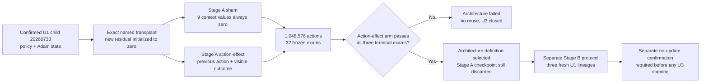
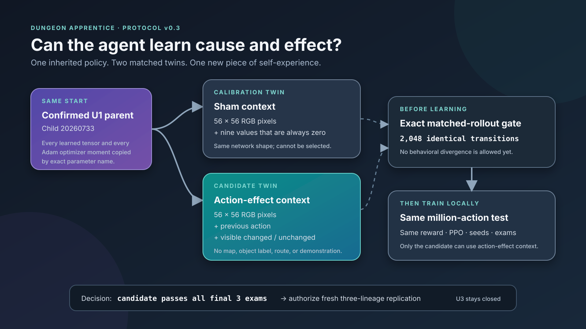

# Protocol v0.3: Matched Action-Effect Architecture Study

> **Controlling operational amendment:** the scientific design below remains unchanged. Original
> Stage-A attempt 0 failed before action one; r1 then reached 38,912 trained sham actions but failed
> before the action-effect arm because of process-control defects. r2 completed the full sham arm,
> but its terminal manifest rejected an authentic first-rollout identity because qualification and
> closeout disagreed about one terminal line-feed byte; action-effect never began. The current
> prospective boundary is the fresh
> [Stage-A r3 amendment](protocol-v0.3-action-effect-architecture-r3.md). No prior Stage-A root or
> checkpoint may be resumed or reused.

> **Current status:** r3 is a prospective replacement. Its release source commit, annotated tag
> object, qualification, cohort, media root, policy actions, and result are all pending. Existing
> historical roots are not authority to begin r3.

## Decision in one sentence

Start two fresh, matched U2 children from the same authenticated confirmed U1 parent; give both the
same new network pathway, but expose the preceding action and its visible changed/unchanged outcome
only to the `action-effect` child; hold reward, PPO, curriculum, budget, and grading fixed; and
select only the architecture definition if the action-effect child independently passes the full
U2-S terminal gate.

## Why this is a new architecture experiment

The terminal U2-S ablation found no eligible configuration. Its control family could learn strong
U2 capability but remained vulnerable to rare catastrophic interaction loops. The most stable
configuration stayed below the fixed capability floor. Conservative PPO reduced capability, and
the pixels-only no-effect reward improved the observed balance without producing an eligible
terminal three-exam window. U2-S therefore ended at its preregistered stopping point: the next
prospective decision must be architectural, not another reward amount, PPO retune, seed,
continuation, or favorable-checkpoint search.

The hypothesis here is deliberately narrow:

> The recurrent learner is asked to infer action consequences from pixels, but the observation at a
> decision boundary does not explicitly identify which preceding action produced the current
> image. Supplying the learner with its own previous action and a one-transition visible-effect
> outcome may make ineffective-interaction evidence easier to retain without suppressing useful
> interactions globally.

This does not provide an oracle, plan, action label from a demonstrator, map state, or handcrafted
solution. It makes one piece of the agent's own immediately preceding sensorimotor experience
explicit and learnable.

## Claims this study may and may not support

Stage A may determine only whether the declared action-effect **architecture definition** earns a
fresh multi-lineage replication study.

It may support:

- an exact matched description of two development trajectories;
- a causal-within-pair architecture interpretation under the shared random stream, with the usual
  limitation that one pair is not a population estimate;
- evidence that the candidate did or did not pass the already frozen U2-S terminal gate; and
- a decision to preregister Stage B when, and only when, the candidate passes.

It may not support:

- promotion, confirmation, deployment, or reuse of either Stage A checkpoint;
- a claim that sham success selects the candidate;
- reopening or revising the U2, U2r-r1, or U2-S verdict;
- a claim that Separated Unlock is confirmed;
- activation of U3;
- a claim about Retrieve, parties, classes, equipment, or the eventual game; or
- use of any intermediate peak in place of the fixed terminal window.

Development exams influence the decision and are not fresh generalization evidence.

## Immutable predecessor evidence

This protocol starts only after the following boundaries have become terminal:

1. U2 confirmation remained `capability_failed`; child `20260745` scored 169/200 against the
   170/200 Separated Unlock gate.
2. U2r-r1 reached its exact full-budget terminal artifact and failed its prospective interaction
   stability requirement.
3. U2-S r1 completed all four matched full-budget arms and selected no configuration.
4. No U2-S checkpoint is promotable or reusable, even if one intermediate or terminal exam looks
   favorable.
5. The unused U2r confirmation reservation remains sealed, and U3 remains closed.

The v0.3 qualifier must authenticate the immutable reports, integrity records, source/tag bindings,
and referenced artifacts behind those statements. A missing, changed, or ambiguously identified
predecessor stops qualification.

## Exact sole Stage A parent

Both twins start independently from the same confirmed U1 child:

| Field | Frozen value |
| --- | --- |
| U0 ancestry | U0 child `20260727` |
| U1 child | `20260733` |
| Archive | `/Volumes/T7 Developer/DungeonApprentice/u1-local-replication-20260722/v02-u1-replication-seed-20260733/checkpoints/mastered-local-unlock.zip` |
| Archive SHA-256 | `3d2950e63491d07d3e483660469b8bec869fa137fa61d6b4d22b3d9f0ded2104` |
| Policy-tensor SHA-256 | `e555d3f7e2364f74e3b43371938c2f25e2ddbf62558a810038509a70868e6888` |
| Optimizer-state SHA-256 | `cc07791b374620d680e5cbb3602d59ab83eb55f195d26808abc0adf5f0e3bc5f` |
| Parent lifetime trained actions | 786,432 |
| Parent optimizer updates | 1,536 |
| U1 confirmation | Navigate 188/200; U0 200/200; U1 182/200; all frozen gates passed |

“Fresh twin” means a new learning trajectory from these exact U1 policy and optimizer bytes. It
does not mean random initialization. Neither twin may load, distill, imitate, inspect for action
selection, or otherwise inherit from a U2, U2r, U2-S, or sibling Stage A policy.

## Fixed Stage A arms

The arms run sequentially in this order:

| Order | Arm | Context presented to the policy | Selectable |
| ---: | --- | --- | --- |
| 1 | `sham` | Nine zeros at every decision | No; calibration only |
| 2 | `action-effect` | Previous primitive action plus visible changed/unchanged outcome | Yes |

Both arms use the same Dict observation space, wrapper stack, feature-extractor class, tensor
shapes, newly added parameter, comparison work, parent transplant, optimizer, recurrent topology,
curriculum, reward, PPO settings, full budget, and exam schedule. The only arm-level difference is
whether the wrapper emits a real action-effect vector or the all-zero sham vector.

The sham cannot select the architecture. If sham passes and action-effect fails, the verdict is
`architecture_failed`. If action-effect passes, the architecture definition is selected whether or
not sham passes. Both arms must still complete valid full-budget records before the rule is applied.

## Policy observation boundary

### Image

The policy retains the same egocentric partial RGB observation:

- environment-facing shape: `56 × 56 × 3`;
- type: unsigned 8-bit pixels;
- vector-policy shape after the existing transpose: `3 × 56 × 56`; and
- no coordinates, map ID, object identity, inventory label, mission text, oracle state, shortest
  path, or trainer-only `info`.

### Action-effect context

The second Dict member is `action_effect`, a nine-element `float32` vector:

- indices 0–6: one-hot encoding of the primitive action selected on the immediately preceding
  transition;
- index 7: visible outcome `changed`;
- index 8: visible outcome `unchanged`; and
- all nine values zero: episode-start sentinel.

At decision time \(t\), the real arm therefore receives action \(a_{t-1}\) and whether the
policy-visible RGB bytes at \(t\) differ from those at \(t-1\). “Changed” means an exact difference
in shape, type, or bytes. The comparison reads only consecutive policy-visible images. It does not
read reward, termination reason, milestones, coordinates, object state, or `info`.

The two explicit outcome coordinates keep `changed`, `unchanged`, and episode start distinct. Reset
always emits the zero sentinel. A terminal transition retains its own action-effect context as the
terminal observation; the following automatic reset emits a new zero sentinel. The sham performs
the same comparison but exposes nine zeros.

Evaluation reconstructs this context online from the same raw images and the policy's own previous
action. It performs no update and receives no hidden evaluator metadata.

## Fixed policy topology

The model remains recurrent PPO with the confirmed parent's visual and recurrent topology:

| Component | Frozen definition |
| --- | --- |
| Policy class | `RecurrentMultiInputActorCriticPolicy` |
| Visual encoder | Existing `NatureCNN`, 512 features |
| Context encoder | Bias-free linear map, 9 inputs → 512 features |
| Fusion | Add context residual to the 512 visual features |
| Initial context weights | Exactly zero |
| Actor LSTM | 512 input, 256 hidden units, one layer |
| Critic LSTM | 512 input, 256 hidden units, one layer |
| Post-LSTM MLP | Empty |
| Action head | Seven primitive actions |

No auxiliary target, oracle loss, action mask, scripted fallback, planning module, reward model, or
language model is added. PPO learns whether and how to use the context through the ordinary task
objective.

## Exact parent-state transplant

Changing from a Box observation to a Dict observation prevents an ordinary archive load from being
scientifically adequate. Each twin must instead construct the declared new policy and perform an
audited transplant:

1. load the exact U1 archive and verify the archive, policy-tensor, optimizer-state, manifest,
   sidecar, confirmation, lifetime-action, and update identities;
2. construct the new policy with the fixed initialization seed;
3. join old and new policy parameters by their stable **names**, never by positional order;
4. require every inherited tensor name and shape to exist in the new policy;
5. copy every inherited tensor exactly;
6. require the only new parameter to be
   `features_extractor.action_effect_encoder.weight`, shape `512 × 9`;
7. set every value of that new tensor to exactly zero;
8. join Adam state by the same stable parameter names and copy every inherited moment and optimizer
   field exactly;
9. require no inherited parameter to lack its expected Adam state;
10. leave the new context tensor with no inherited moment; and
11. restore inherited counters to 786,432 trained actions and 1,536 optimizer updates before
    beginning child accounting.

A positionally loaded optimizer is invalid because insertion of one parameter can silently attach
moments to the wrong tensor. Any extra new parameter, missing legacy parameter, shape mismatch,
missing inherited Adam state, nonzero context weight, counter mismatch, or digest mismatch stops
the run before action one.

## Zero-context equivalence and first-rollout identity

Zero initialization is a scientific bridge, not merely a convenient initializer.

Before any rollout, qualification must prove exact tensor equality between the legacy U1 model and
the transplanted model under zero context for:

- 512-dimensional extracted features;
- deterministic actions;
- value estimates;
- action log probabilities; and
- actor and critic recurrent states.

The equality is bit-for-bit on the same device and package stack, not a tolerance check.

Both Stage A twins then begin from separately reconstructed but digest-identical parent,
architecture, optimizer, environment, scheduler, recurrent, and RNG states. Although the candidate
observes nonzero context after its first transition, the zero context encoder makes that signal
behaviorally inert until learning changes the new weight. Therefore the complete first
2,048-transition rollout collected **before the first optimizer update** must be identical between
arms:

- action sequence;
- policy-visible image sequence;
- raw task and intrinsic rewards;
- episode-start and termination sequence;
- lesson and layout identities;
- recurrent outputs; and
- complete post-rollout/pre-update RNG identity.

The first optimizer phase is the earliest permitted divergence. The candidate's nonzero context
may create a gradient for the new tensor; sham's all-zero input may not. Qualification must exercise
that boundary in a disposable full-size rollout/update smoke and prove that both policies update,
that no context affects the first rollout, and that any divergence begins only after optimization.

A failure of first-rollout identity is an implementation or randomization failure, not an
experimental result.

## Matched randomness

Both arms use:

- architecture initialization seed `20260756`;
- algorithm seed `20260757`;
- worker streams `20260757`, `20260758`, `20260759`, and `20260760`; and
- the same pre-arm static lesson-specific training-layout guards and development suites.

These are matched random numbers, not two independent replications. Arm identity may not advance,
salt, or replace any RNG before the intervention can legitimately affect behavior. Before each arm,
the runner reconstructs all state fresh from the U1 parent. No policy tensor, optimizer moment,
rollout buffer, scheduler counter, recurrent state, episode, or RNG state flows from sham to
action-effect.

The canonical report must record the same post-reset/pre-action RNG digest for both arms and for the
disposable qualification smoke. That identity covers Python, global NumPy, Torch CPU and any
available accelerator, policy and action-space RNG, scheduler state, all four worker spaces and
base-environment RNGs, and deterministic first-episode positions.

## Unchanged task, curriculum, reward, and PPO

This study changes the policy input architecture only. It retains the original U2 control:

- 9 × 9 Navigate, Visible Unlock U0, Local Unlock U1, and Separated Unlock U2 generators and
  horizons;
- seven primitive actions;
- transition-deficit scheduling with the same 50% Navigate, 7.5% U0, 7.5% U1, and 35% U2 normal
  target;
- the same prerequisite recovery controller and profiles;
- success reward `+1.0`;
- ordinary step cost `-0.001`;
- pixels-only novelty scale `0.002`, with episodic cap `0.1`;
- no no-effect penalty or other new reward;
- timeout as terminal failed quest;
- four workers, each collecting 512 transitions per rollout;
- batch size 256, four PPO epochs, learning rate `2.5e-4`, clip range `0.2`, entropy coefficient
  `0.01`, gamma `0.995`, and GAE lambda `0.98`; and
- deterministic, no-update, no-curiosity evaluation with recurrent state reset for every case.

No target-KL stop or conservative schedule is introduced. Raw and discounted reward-dominance
checks remain mandatory.

## Lesson-specific history guards

Before either arm starts, qualification must reconstruct and digest-bind one static guard inventory
using the same scientifically workable mapping as U2-S:

| Lesson | Hard exact-layout training guard |
| --- | --- |
| Navigate | Same-lesson development, qualification/confirmation references, and authenticated completed historical Navigate identities |
| Visible Unlock U0 | Its 79 unique frozen development layouts only; all other historical overlap remains diagnostic |
| Local Unlock U1 | Same-lesson development/confirmation references and authenticated completed historical U1 identities |
| Separated Unlock U2 | Sealed qualification, development/confirmation references, and authenticated completed or active historical U2/U2r/U2-S identities |

The guard is frozen before sham and supplied unchanged to action-effect. A sham layout is not added
to the candidate's hard guard, because doing so would break the matched distribution. Every
episode-start and active-worker layout identity is still persisted for audit. The trainer may not
load a historical image, action trace, score, or role label into policy learning.

## Protected seed boundary

The numbers `20260757`–`20260760` identify algorithm and worker RNG streams. They do not authorize
environment seeds in a protected numerical partition.

Policy training may draw layouts only through the guarded ordinary training allocation
`0`–`999_999`. Scheduled development exams may access only the frozen suites:

| Suite | Range |
| --- | --- |
| Navigate development | `10_000_000`–`10_000_079` |
| Visible Unlock U0 development | `11_000_000`–`11_000_079` |
| Local Unlock U1 development | `11_100_000`–`11_100_079` |
| Separated Unlock U2 development | `11_200_000`–`11_200_079` |

The architecture implementation, disposable smoke, qualifier, trainers, dashboard, and terminal
selector must refuse all of the following:

- the already consumed U2 confirmation streams `15_200_000`–`15_239_999`;
- the still unopened U2r reservation `15_240_000`–`15_279_999`; and
- the complete-project final allocation `20_000_000`–`20_299_999`.

The old sealed U2 qualification allocation `5_210_000`–`5_211_999` was already claimed and may not
be reopened. Because v0.3 changes neither generator nor mechanics, its new release qualification
must authenticate the predecessor's environment qualification and use disposable engineering
layouts only; it opens no new protected capability cases. No confirmation or final-test access
issuer belongs to Stage A.

## Exact budget and evaluation schedule

Each arm receives exactly **1,048,576 new child actions**, for a terminal lifetime count of
1,835,008. With four workers and 512 transitions per worker, each arm completes 512 rollout/update
boundaries and reaches optimizer update 3,584.

Every 32,768 trained child actions, after the optimizer phase, the arm runs one frozen exam:

- 80 Navigate cases, split 40 + 40;
- 80 Visible Unlock U0 cases, split 40 + 40;
- 80 Local Unlock U1 cases, split 40 + 40; and
- 80 Separated Unlock U2 cases, split 40 + 40.

This produces 32 exams and 10,240 per-case records per arm. Every exam checkpoint, sidecar, model
state, optimizer state, integrity record, and case-evidence file is retained. Exams describe trained
parameters; collection and trained-action counters are separate.

Both arms run to the exact full budget regardless of apparent mastery. No intermediate exam may
stop an arm, alter the other arm, select a checkpoint, or change this protocol. The only decision
window is the final three post-update exams:

`983,040`, `1,015,808`, and `1,048,576` child actions.

## Frozen terminal gate

The action-effect candidate is eligible only if **each** of its final three exams independently
satisfies every U2-S requirement:

1. the exam follows an allocation-valid normal-practice window;
2. Navigate is at least 68/80 overall and 34/40 in each panel;
3. Visible Unlock U0 is at least 68/80 overall and 32/40 in each panel;
4. Local Unlock U1 is at least 68/80 overall and 32/40 in each panel;
5. Separated Unlock U2 is at least 72/80 overall and 34/40 in each panel;
6. mean ineffective interactions are at most 3.0 independently on U0, U1, and U2;
7. no case in any lesson has 10 or more ineffective interactions; and
8. no case in any lesson has a repeated identical pickup/drop/toggle action run of 10 or more.

The inequalities are exact. Results are never averaged across the three boundaries to rescue a
failure. An earlier passing streak cannot replace a failed terminal window.

The report preserves all U2-S per-case tail diagnostics plus action-effect-specific summaries:
context activation rate, changed/unchanged rate by action and lesson, context-encoder norm and
update norm after every optimizer phase, and the first phase at which the paired trajectories
diverge. These measurements may explain the result but cannot alter the gate.

## Stage A decision and stop rule

After two valid full-budget terminal reports exist:

- if the action-effect candidate passes all three terminal exams, the verdict is
  `architecture_selected`;
- otherwise the verdict is `architecture_failed`;
- sham is always calibration-only;
- no Stage A checkpoint is eligible for reuse; and
- U3 remains closed under either verdict.

An interrupted or invalid arm prevents a scientific verdict. It does not become a negative
architecture result.

## Non-resumable matched study

Stage A is deliberately **non-resumable**. Resetting or continuing only one twin would break the
matched environment, scheduler, recurrent, and random trajectory. Any trainer, supervisor, source,
storage, or machine interruption makes the entire canonical root terminal
`operationally_incomplete`.

Do not resume a tip, reuse the completed twin, rerun only the missing twin, rename the root, or
silently create a replacement. A replacement requires a separately committed protocol-attempt
identity, externally anchored tag, qualification, cohort root, and two fresh twins from the exact
U1 parent.

## Qualification and fail-closed release boundary

This document does not itself authorize a run. Before action one, one clean release must bind:

1. the exact protocol and implementation bytes;
2. a clean, pushed source commit and one annotated tag at the approved GitHub origin;
3. the immutable U1 parent archive, policy tensors, optimizer state, sidecar, manifest,
   confirmation, counters, and digests;
4. terminal U2, U2r-r1, U2-S, and failed-launch evidence with every referenced checksum;
5. absence of any U2/U2r/U2-S checkpoint path in the v0.3 loader;
6. the Dict observation keys, types, shapes, reset sentinel, transition timing, terminal/reset
   handling, and evaluation adapter;
7. exact named tensor and named Adam transplantation, including the sole new zero tensor;
8. bit-exact legacy/zero-context feature, policy-output, and recurrent-state equivalence;
9. a disposable, real four-worker, 2,048-transition matched first-rollout test and one optimizer
   phase per arm;
10. exact first-rollout identity and divergence no earlier than the first optimizer update;
11. unchanged original U2 reward, PPO, curriculum, mechanics, guard mapping, budgets, and gates;
12. denied confirmation/final access and zero protected seed hits;
13. the architecture seed, algorithm seed, worker streams, complete pre-action RNG digest, and
   `runtime_contract`: Python/platform/machine plus Gymnasium, MiniGrid, NumPy, sb3-contrib,
   Stable-Baselines3, and Torch versions, with both training and qualification smoke fixed to CPU;
14. a mounted external T7 with at least 25 GiB free and nonoverlapping absent canonical
   qualification, cohort, and media roots;
15. one-trainer sequential execution, bounded checkpoint retention, storage caps, and a read-only
    dashboard identity; and
16. removal of all public arm, seed, parent, checkpoint, budget, resume, or protected-evaluation
    overrides.

The disposable smoke must write only inside a temporary engineering root, remove that root, and
prove canonical and predecessor evidence unchanged afterward. Its updated policies are destroyed
and non-promotable.

The release chain is non-circular. First, one published annotated tag binds the source commit,
protocol, architecture, and runtime contracts, parent and predecessor evidence, protected
partitions, assigned roots, dashboard, caps, and non-resume rule. Qualification then creates a
durable claim before its own output and emits a canonical report plus SHA-256 sidecar that bind the already
published tag object. Finally, the cohort contract and manifest bind that exact qualification
report digest before the canonical launcher can act. The tag does not and cannot contain the digest
of a report produced afterward.

A failed or partial qualification permanently blocks that attempt identity. A network failure may
not repeat tests that open or mutate evidence. The canonical launcher must fail closed if the tag,
report, source, parent, predecessor, root identity, process count, storage reserve, package stack,
or qualification binding does not match.

The claim-bearing release assigns the following exact operational identities:

| Boundary | Frozen value |
| --- | --- |
| Annotated tag | `action-effect-architecture-v0.3-stage-a-20260724` |
| Qualification | `/Volumes/T7 Developer/DungeonApprentice/qualifications/v0.3-action-effect-stage-a-20260724` |
| Cohort root | `/Volumes/T7 Developer/DungeonApprentice/v03-action-effect-stage-a-20260724` |
| Media root | `/Volumes/T7 Developer/DungeonApprentice/v03-action-effect-stage-a-media-20260724` |
| Dashboard | `http://127.0.0.1:8788/` |
| Training device | CPU |
| Qualification-smoke device | CPU |
| Per-arm scientific cap | 2 GiB |
| Cohort scientific cap | 4 GiB |
| Media cap | 6 GiB |
| Combined cap | 10 GiB |

The canonical launcher is `scripts/run_v03_action_effect_stage_a.sh`. It becomes authoritative
only after the exact source is clean, committed, published, annotated with the declared tag
payload, and bound to one successful qualification report. Calling a lower-level trainer directly
does not create scientific evidence. Terminal finalization additionally requires a manifest-owned,
command-redacted process inventory with no trainer, supervisor, or sleep-prevention process and a
second clean live scan immediately before the report is written; the read-only dashboard may
remain.

The implementation declares four entry points:

| Entry point | Bounded role |
| --- | --- |
| `dungeon-smoke-v03-action-effect` | Disposable matched rollout/update proof |
| `dungeon-qualify-v03-action-effect` | One-line tag payload and one-shot qualification |
| `dungeon-train-v03-action-effect` | Launcher-owned single-arm trainer |
| `dungeon-dashboard-v03-action-effect` | Read-only cohort evidence |

None is a substitute for the fixed launcher, and the trainer may never be called directly for a
canonical arm.

## Conditional Stage B: three-lineage replication

Stage B is not part of this run and cannot start automatically.

Only `architecture_selected` may authorize a new, separately committed and qualified Stage B
protocol. That protocol must:

- instantiate the selected architecture definition from each of the three independently confirmed
  U1 children `20260725`, `20260729`, and `20260733`;
- perform the same audited named tensor/Adam transplant separately for each lineage;
- allocate fresh algorithm and worker streams that were not used in Stage A;
- use the original U2 reward/PPO/curriculum, full per-lineage budget, fixed exams, and terminal gate;
- train three fresh policies sequentially;
- inherit no Stage A checkpoint, optimizer, rollout, curriculum, recurrent, RNG, or episode state;
- preregister an all-lineage decision rule before training;
- remain non-resumable or define a scientifically symmetric recovery rule before action one;
- retain confirmation and final ranges structurally unavailable; and
- select only prospectively declared terminal artifacts.

A Stage B success would still be development replication, not confirmation. Opening any fresh
no-update U2 confirmation would require another separately committed, externally anchored
one-shot plan after Stage B becomes immutable. **U3 remains closed unless that future replication
and its future confirmation both pass their own frozen rules.**

## Required terminal evidence

A valid Stage A report must bind:

- source commit, annotated tag object, remote, qualification report bytes, and package lock;
- complete parent provenance and all transplant evidence for both arms;
- the zero-context equivalence record;
- paired pre-action and first-rollout identities;
- every arm manifest, status, event, episode, optimizer, reward, and layout-start record;
- all 64 exam bundles and all 20,480 case records;
- every archive, sidecar, model-state, optimizer-state, report, and integrity digest;
- collected actions, trained actions, optimizer updates, terminal lifetime counters, and storage;
- final-three grades for both arms and the deterministic candidate-only decision;
- confirmation/final access denial and zero protected seed hits;
- interruption or crash evidence, when applicable; and
- proof that no trainer, supervisor, or sleep-prevention process remains orphaned.

The narrative summary should show the inherited baseline, first 32,768-action exam, all three
terminal exams, tail behavior, and the point after the first optimizer update where the matched
trajectories first diverged. That makes the central question visible: did explicit sensorimotor
context preserve the parent's skills while turning “that action did nothing” into a fact the
learner could use?
