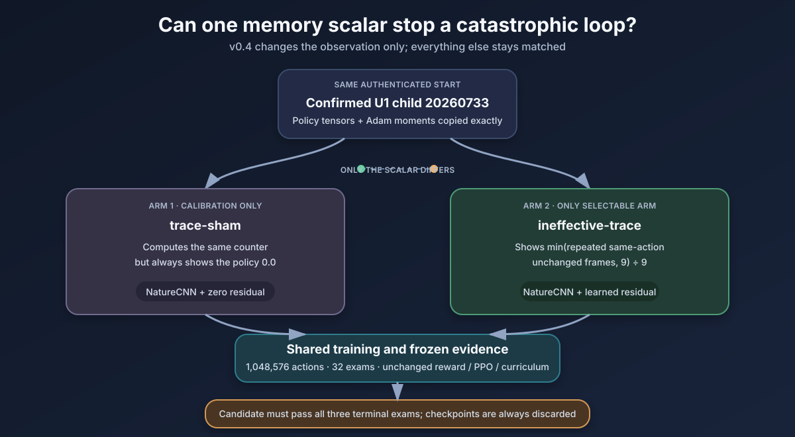

# Protocol v0.4: Matched Ineffective-Trace Architecture Study

Status: **prospective; source release, annotated tag, one-shot qualification, and launch are
separate gates**

## Decision in one sentence

Start two fresh twins from the same authenticated confirmed-U1 parent; give both the same new
one-scalar residual pathway; expose a bounded count of consecutive same-action, byte-identical
visible outcomes only to `ineffective-trace`; hold reward, PPO, curriculum, budget, randomness,
and grading fixed; and select only the architecture definition if the candidate passes all three
terminal exams.

## Why this study exists

The completed v0.3 r3 matched study was a valid scientific negative. Its `action-effect` encoder
learned—every one of its 4,608 weights became nonzero—but the candidate retained nine catastrophic
terminal tails while the sham retained one. Every candidate tail was almost entirely one action
repeated against an unchanged RGB observation:

| Primitive | Candidate terminal tails |
| --- | --- |
| Pickup | 144, 149, 150, 152, 156, and 160 repeated actions |
| Toggle | 45 and 124 actions |
| Drop | 149 actions |

The nine-value action-effect input is stationary inside such a loop: every step presents the same
action one-hot and the same `unchanged` bit. The recurrent model could theoretically count the
steps, but the terminal evidence shows that it did not do so reliably. Worse, explicitly returning
the last action may have created an autoregressive shortcut that reinforced repetition.

v0.4 therefore **replaces**, rather than extends, the failed nine-value pathway. It presents no
action identity and no interaction label. It adds only the duration signal that was missing from
the repeated-loop state.

This is an architecture study, not a reward rescue. It does not change the reward, penalize an
action, mask or force a choice, add demonstrations, enlarge the recurrent model, or select a
favorable checkpoint.

## Immutable predecessor boundary

Qualification must authenticate the completed r3 record before v0.4 may create a cohort:

| Evidence | Frozen r3 identity |
| --- | --- |
| Source commit | `c4834b73dfed7d875c6f59887d3077319a305910` |
| Annotated tag | `action-effect-architecture-v0.3-stage-a-r3-20260724` |
| Tag object | `fc5eb2f82896b7f6d41030f2776a0028a70ea4c2` |
| Qualification report SHA-256 | `07151fecea179dfaedabe56dcadc009d3750798987973c17cb67b1888909c499` |
| Cohort-contract SHA-256 | `fea7b7eb10accec2395105630ad790d550993996c5bd35a2a937fdb8837d5ade` |
| Final cohort-state SHA-256 | `fb99ab57244d1e1b2a6bc5f9cdfd7f1763038c8186b174587b9e4d95cecbc8db` |
| Cohort report SHA-256 | `05f23509652e48a127be3728fb4ccb052b8285035792db9aaec7a956e021dcdb` |
| Report-integrity SHA-256 | `0e42c78e7a1b541d55c4286ccf606f1477a453914427cd74ebe59af8568b81a4` |
| Process-closeout SHA-256 | `1e8512fd2a20c3371d8c6207ee9ef6f10955fa1e14a8556d3d46f25ea79d2641` |
| Scientific tree | 315 files, 1,891,170,919 bytes |
| Scientific file-map SHA-256 | `39eb42ba11f3a56976def56cbdd7493c3202f79c756772feea9375240e6396c8` |
| Qualification file-map SHA-256 | `83929801d494a2c3a0e1cdeb6b1b88877e9da04e8104546c99e89dc6ce39f6f7` |
| Screen log SHA-256 | `31cf55aba551c5b084d658161b51849db077ec225d22b7abb9bbda302eda169f` |
| Terminal verdict | `architecture_failed` |
| Selected architecture | `null` |

The qualifier must recompute the complete regular-file maps, not merely trust the summary above.
It must also verify two completed arms, exactly 1,048,576 child actions and 32 exams per arm,
10,240 cases per arm, exact report/checkpoint bindings, a clear process closeout, no promotable
checkpoint, and no Stage-B or U3 authorization.

r3 is rationale only. No r3 policy, optimizer state, recurrent state, rollout, RNG state, or
checkpoint may cross into v0.4. The r3 scientific, media, qualification, and launcher-log roots are
immutable and must never be resumed, reused, pruned, renamed, or overwritten.

## Sole parent

Both v0.4 arms reconstruct independently from confirmed U1 child `20260733`:

| Field | Frozen value |
| --- | --- |
| Parent child identity | U2 registry child `20260745`, backed by U1 child `20260733` |
| Archive | `/Volumes/T7 Developer/DungeonApprentice/u1-local-replication-20260722/v02-u1-replication-seed-20260733/checkpoints/mastered-local-unlock.zip` |
| Archive SHA-256 | `3d2950e63491d07d3e483660469b8bec869fa137fa61d6b4d22b3d9f0ded2104` |
| Policy-tensor SHA-256 | `e555d3f7e2364f74e3b43371938c2f25e2ddbf62558a810038509a70868e6888` |
| Optimizer-state SHA-256 | `cc07791b374620d680e5cbb3602d59ab83eb55f195d26808abc0adf5f0e3bc5f` |
| Parent lifetime actions | 786,432 |
| Parent optimizer updates | 1,536 |

Every compatible policy tensor and Adam moment transfers by stable parameter name. The new trace
weight begins at exact zero with no inherited optimizer moment. U2, U2r, U2-S, v0.3, sibling, or
intermediate checkpoints are forbidden.

## Fixed identities

| Item | Prospective assignment |
| --- | --- |
| Protocol | `dungeon-apprentice-v0.4-ineffective-trace-architecture` |
| Cohort ID | `v0.4-ineffective-trace-stage-a-20260724` |
| Annotated tag | `ineffective-trace-architecture-v0.4-stage-a-20260724` |
| Qualification root | `/Volumes/T7 Developer/DungeonApprentice/qualifications/v0.4-ineffective-trace-stage-a-20260724` |
| Cohort root | `/Volumes/T7 Developer/DungeonApprentice/v04-ineffective-trace-stage-a-20260724` |
| Media root | `/Volumes/T7 Developer/DungeonApprentice/v04-ineffective-trace-stage-a-media-20260724` |
| Dashboard | `http://127.0.0.1:8792/` |
| Launcher | `scripts/run_v04_ineffective_trace_stage_a.sh` |
| Architecture initialization seed | `20260761` |
| Algorithm seed | `20260762` |
| Worker streams | `20260762`, `20260763`, `20260764`, `20260765` |

The source commit, annotated tag object, canonical tag payload, qualification report, and cohort
contract do not exist yet. Their exact hashes must be added by the external release chain. This
document by itself is not authority to train.

Qualification must scan all repository and preserved experiment evidence and fail if any fresh
seed or root identity was previously consumed.

## Matched arms

The arms run sequentially in this fixed order:

| Order | Arm | Scalar exposed to the policy | Selectable |
| ---: | --- | --- | --- |
| 1 | `trace-sham` | Always `0.0` | No; calibration only |
| 2 | `ineffective-trace` | The bounded policy-visible repetition trace | Yes |

Both arms perform the same RGB comparisons, action-equality comparisons, and counter updates.
Both have the same Dict observation space, tensor topology, zero-initialized new weight, parent
transplant, initialization, optimizer, random streams, reward, curriculum, budget, and frozen
exams. Their only learner-facing difference is whether an already-computed scalar is zero or
truthful.

If the candidate fails, the verdict is `architecture_failed` regardless of the sham. A sham pass
cannot select the candidate. A candidate pass selects only the architecture definition.

## Exact trace

Let \(x_t\) be the policy-visible RGB frame after reset or transition, \(a_t\) the primitive action
selected at time \(t\), and \(r_t\) the internal counter. At reset:

\[
r_0 = 0
\]

After action \(a_t\) yields frame \(x_{t+1}\):

\[
r_{t+1} =
\begin{cases}
0 & \text{if } x_{t+1} \ne x_t \\
1 & \text{if } x_{t+1}=x_t \text{ and } (t=0 \text{ or } a_t\ne a_{t-1}) \\
\min(9,r_t+1) & \text{if } x_{t+1}=x_t \text{ and } a_t=a_{t-1}
\end{cases}
\]

The candidate receives one `float32`:

\[
z_{t+1}=r_{t+1}/9
\]

The sham receives `0.0` after performing the identical update.

The cap of nine is frozen before action one because the existing stability gate forbids a tenth
consecutive ineffective or identical interaction. It may not be retuned after seeing v0.4.

Frame equality compares shape, dtype, and exact bytes of the same `56 × 56 × 3` RGB observation
the policy already receives. Action equality compares two self-selected primitive action IDs but
does not expose either ID. The trace covers all seven actions and has no handcrafted concept of
“interaction.”

Reset emits zero. A changed frame resets the counter to zero. Switching action on an unchanged
frame starts a new run at one. The terminal transition retains its own trace; the following
automatic reset begins again at zero.

The wrapper may not read reward, trainer `info`, coordinates, objects, inventory, map state,
mission text, milestones, oracle state, or hidden emulator/game state. The trace changes only the
observation. It never masks, repeats, vetoes, forces, or chooses an action.

Evaluation reconstructs the same trace online from raw visible images and the policy's own actions.
It performs no learning.

## Policy topology and exact transplant

Both arms use:

\[
f_t=\operatorname{NatureCNN}(x_t)+W_z z_t
\]

| Component | Frozen value |
| --- | --- |
| Policy class | `RecurrentMultiInputActorCriticPolicy` |
| Visual encoder | Inherited NatureCNN, 512 features |
| Trace encoder | Bias-free `Linear(1, 512)` |
| New parameters | Exactly 512 weights |
| New-weight initialization | Exact zero |
| Fusion | Additive residual |
| Actor LSTM | 512 input, 256 hidden, one layer |
| Critic LSTM | 512 input, 256 hidden, one layer |
| Post-LSTM MLP | Empty |
| Action head | Seven primitive actions |

The failed v0.3 `action_effect_encoder` must be absent. The only new parameter is
`features_extractor.ineffective_trace_encoder.weight`, shape `512 × 1`.

The transplant must:

1. verify the exact parent archive, policy tensors, optimizer, counters, and confirmation;
2. construct a fresh declared v0.4 policy;
3. match every inherited parameter by name and exact shape;
4. copy every compatible policy tensor exactly;
5. copy every inherited Adam state by parameter name, never position;
6. require the trace encoder to be the sole new tensor and set it to exact zero;
7. require the new tensor to have no inherited optimizer moment;
8. restore 786,432 lifetime actions and 1,536 optimizer updates; and
9. prove zero-trace features, logits, values, actions, and recurrent states are bit-exact to U1.

Because \(W_z=0\), both arms must also produce the same complete pre-update 2,048-transition
trajectory, policy outputs, episode starts, and RNG identities. Behavioral divergence before the
first optimizer is a protocol failure.

## Frozen learning and evaluation

Each arm uses the unchanged U2 control:

| Field | Frozen value |
| --- | ---: |
| Workers | 4 |
| Rollout steps per worker | 512 |
| Transitions per optimizer phase | 2,048 |
| Batch size | 256 |
| PPO epochs | 4 |
| Learning rate | `2.5e-4` |
| Gamma | `0.995` |
| GAE lambda | `0.98` |
| Entropy coefficient | `0.01` |
| Clip range | `0.2` |
| New child actions | 1,048,576 |
| Lifetime actions at terminal | 1,835,008 |
| Lifetime optimizer updates at terminal | 3,584 |
| Evaluation interval | 32,768 actions |
| Exams per arm | 32 |
| Frozen cases per exam | 320 |
| Cases per arm | 10,240 |

Reward, curriculum, lesson mechanics, horizons, action space, protected seed partitions, static
history guard, prerequisite recovery, and evaluation cases remain unchanged. There is no early
stopping, resume, mid-run retuning, arm replacement, or intermediate checkpoint selection.

## Terminal selection

The final three exams occur at 983,040, 1,015,808, and 1,048,576 child actions. The candidate is
eligible only if **every** terminal exam passes the complete frozen U2-S gate:

- existing Navigate, U0, U1, and U2 lesson gates;
- U2 at least 72/80 overall and 34/40 in each panel;
- mean ineffective interactions at most three for U0, U1, and U2;
- no case with ten or more ineffective interactions;
- maximum ineffective interactions below ten;
- maximum repeated identical-interaction run below ten;
- valid lesson allocation and normal practice profile; and
- complete, contiguous, authenticated exam and case evidence.

The trace run length is reported as an additional diagnostic. It does not replace or weaken the
existing gates.

Passing Stage A authorizes only a separately versioned, prospectively frozen three-lineage
replication from fresh confirmed-U1 children. Neither Stage-A checkpoint is reusable or
promotable. U3 remains closed. Confirmation and final seed issuers remain sealed.

## Qualification gates

Before release can launch, qualification must:

- authenticate the immutable r3 terminal tree, tag, qualification, counters, exams, cases,
  checksums, negative selection, storage, and clear process closeout;
- authenticate confirmed U1 directly and prove no later checkpoint is loaded;
- prove the fresh seed and root identities are unused;
- prove wrapper reset, action-switch, visible-change, cap, dtype, shape, and sham-zero behavior;
- prove training and evaluation adapters reconstruct the same scalar;
- prove no reward, `info`, or privileged field can influence the trace;
- prove both arms have byte-identical parameter topology and initialization;
- prove the sole new tensor is exact zero and every inherited tensor/Adam moment matches U1;
- prove exact zero-trace equivalence to U1;
- run one disposable, real four-worker rollout and one ordinary optimizer phase per arm;
- prove the complete pre-update behavior and RNG identities match;
- prove candidate traces are actually exercised in the smoke;
- prove the sham encoder weights and Adam moments remain zero after the update;
- prove at least one candidate encoder weight becomes nonzero only after the first update;
- reload both disposable archives and then destroy them;
- bind source, annotated tag, parent, roots, seeds, guard, storage caps, dashboard port, and
  selection logic; and
- preserve the non-circular release order.

Tampering with the trace formula, cap, mode, dimension, parent, seed, source, tag, root, qualification
binding, first-rollout envelope, checkpoint, report, case evidence, arm order, or selection rule
must fail closed.

## Operations and storage

The cohort has no resume path. Any interruption or crash makes the entire matched root
`operationally_incomplete`; a replacement requires a fresh source, tag, qualification, roots,
seeds, and two fresh twins.

The launcher must use a detached user-context `screen` session with proven T7 access. It runs
exactly one launcher, one active-arm supervisor, one trainer, and one `caffeinate` chain. The
dashboard is read-only. A sealed process closeout with no trainer, supervisor, or `caffeinate`
process is required before terminal finalization.

| Scope | Cap |
| --- | ---: |
| Per-arm scientific artifacts | 2 GiB |
| Cohort scientific artifacts | 4 GiB |
| Narrative media | 6 GiB |
| Combined planned artifacts | 10 GiB |
| Minimum free space before launch and each arm | 25 GiB |

## Release order

1. Preserve and document r3 without changing a byte.
2. Implement the separately versioned trace module, protocol, tests, qualification, trainer,
   manifest, dashboard, and launcher.
3. Pass the complete repository suite, mechanical qualification, focused smoke, source/seed/root
   audit, and two independent read-only audits.
4. Commit and push one clean source.
5. Derive the one-line tag payload from that exact source.
6. Create and publish the annotated v0.4 tag.
7. Run one-shot qualification into the absent canonical root.
8. Reauthenticate source, tag, parent, r3, seeds, guard, storage, roots, port, and process boundary.
9. Confirm the cohort and media roots are absent.
10. Launch exactly one canonical cohort in a detached user-context `screen`.
11. Run `trace-sham` to exact terminal closeout before the candidate records action one.
12. Run `ineffective-trace` to its exact ceiling.
13. Seal the process closeout and matched terminal report.

The annotated tag preregisters source and contracts. The later qualification report binds that
exact tag object. The cohort contract then binds the qualification SHA-256. Never claim that the
tag contains a qualification digest created later.

## Interpretation boundaries

If the candidate passes, the strongest claim is that explicit bounded persistence earned a fresh
multi-lineage replication under this one matched development pair. If it fails, this one-scalar
intervention did not meet the frozen gate.

If both arms pass, the architecture is viable but necessity remains uncertain. If only the
candidate passes, the within-pair causal case is stronger. If only sham passes, the candidate
fails. No outcome confirms U2, opens U3, promotes a checkpoint, or proves the eventual management
game.

Known failure modes to report without changing the protocol:

- the policy may ignore the scalar;
- it may alternate two ineffective actions to reset the count;
- visible animation may reset an exact-pixel count without task progress;
- one scalar imposes an intentionally monotonic representation; and
- one lineage is development evidence, not a population estimate.
