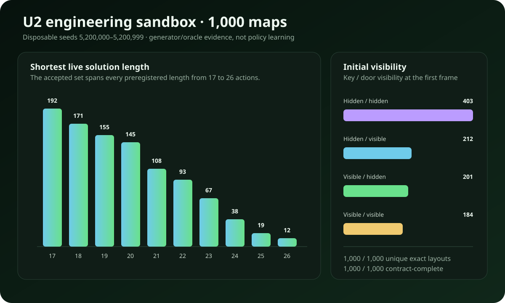

# U2 engineering sandbox: 1,000 generated maps

> **Status:** generator engineering evidence only. This is not policy-learning evidence, it did
> not open the sealed preflight or any validation/future/final seed, and it cannot satisfy a U2
> promotion gate.

On July 23, 2026, the frozen U2 generator and privileged live oracle were exercised across the
entire disposable engineering partition, seeds `5,200,000`–`5,200,999`. The purpose was narrow:
check that the proposed *Separated Unlock* lesson can reliably produce varied, solvable maps before
the one-shot sealed qualification is allowed to open.

## Result

| Check | Measured result |
|---|---:|
| Generated and contract-complete | 1,000 / 1,000 |
| Exact unique layouts | 1,000 |
| Geometry-unique layouts | 1,000 |
| Pure planner/live action-sequence match | 1,000 / 1,000 |
| Key → matching door → exit completed in order | 1,000 / 1,000 |
| Exactly two extra walls | 1,000 / 1,000 |
| At least one turn after collecting the key | 1,000 / 1,000 |
| Locked goal actually blocked | 1,000 / 1,000 |
| Observation and reward contracts | 1,000 / 1,000 |
| Shortest live solution range | 17–26 actions |
| Mean generator attempts per accepted map | 2.266 |
| Highest attempts needed for one accepted map | 15 |
| Sweep wall time | 6.584 seconds |

The shortest-solution distribution was:

| Actions | 17 | 18 | 19 | 20 | 21 | 22 | 23 | 24 | 25 | 26 |
|---:|---:|---:|---:|---:|---:|---:|---:|---:|---:|---:|
| Maps | 192 | 171 | 155 | 145 | 108 | 93 | 67 | 38 | 19 | 12 |

The initial visibility strata were also populated rather than collapsing to one easy presentation:

| Key initially visible | Door initially visible | Maps |
|---|---|---:|
| No | No | 403 |
| No | Yes | 212 |
| Yes | No | 201 |
| Yes | Yes | 184 |

Divider orientation was nearly balanced (508 horizontal, 492 vertical), as was the approach side
(509 high-side, 491 low-side). Door colors were blue 252, purple 255, red 255, and yellow 238.

## Interpretation

This test answers “can the machinery consistently make the intended problem?” with **yes**. It does
not answer “can the recurrent policy learn the problem?” The oracle is a privileged measurement
instrument and its action sequence is never shown to the policy. The policy still receives only
pixels and its own recurrent state.

The next scientific boundary remains unchanged:

1. finish and test the trainer, resume, storage, seed, and dashboard safeguards;
2. commit one clean source revision;
3. open the fixed 2,000-map sealed preflight exactly once;
4. only if it passes, start three independently inherited U2 children sequentially.

No sealed qualification, U2 validation, future-confirmation, or final-test map was opened for this
engineering sweep.
