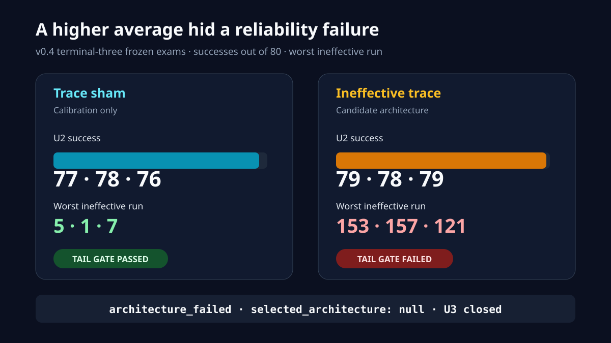

# v0.4 Stage A: ineffective-trace architecture result

Status: **terminal `architecture_failed`; no architecture selected; no checkpoint reuse; U3 closed**

## Outcome

v0.4 asked a deliberately narrow question: would one policy-visible scalar describing how long the
same action had produced no visible change eliminate the rare interaction loops that defeated
v0.3? Two fresh twins reconstructed independently from confirmed U1 child `20260733`. Both had the
same new bias-free `Linear(1, 512)` residual, but `trace-sham` always received zero while
`ineffective-trace` received
`min(consecutive same-action unchanged frames, 9) / 9`.

Both arms completed exactly 1,048,576 child actions, 2,048 new optimizer updates, 32 frozen exams,
and 10,240 deterministic exam cases. Their initial RNG state and complete pre-update
2,048-transition rollout matched. The candidate trace then became active at the first optimizer
boundary and remained active on 123,552 transitions. This was a live, learned intervention rather
than a wiring failure.

The candidate finished with the stronger average capability. Across the final three exams it
averaged **78.67/80 U2 successes** and **316.67/320 total lesson successes**, compared with
**77.00/80** and **315.33/320** for sham. It nevertheless failed the prospectively frozen
reliability rule. A few candidate cases still entered catastrophic loops lasting 121–157 actions;
sham's worst final runs were only 1–7 actions.



The sealed decision is therefore:

```text
architecture_failed
selected_architecture: null
development_checkpoint_reuse_authorized: false
replication_protocol_authorized: false
u3_authorized: false
```

The important result is not “the model learned nothing.” It learned slightly more average
capability while becoming less reliable in a small but disqualifying tail. The frozen rule was
designed to keep that distinction visible.

## Frozen identity

| Evidence | SHA-256 or identity |
|---|---|
| Completed | `2026-07-24T19:17:02Z` |
| Source commit | `0d417255a0b344f4863045862adf0617c49f51bf` |
| Source tree | `dcf811d9ca65974479f698ab4b2e770f3f8e49ad` |
| Source clean at closeout | `true` |
| Annotated tag | `ineffective-trace-architecture-v0.4-stage-a-20260724` |
| Annotated tag object | `754278095226c324e3191e39c70d2297730f8573` |
| Qualification report | `6d23e925b3b0fdaaf9e621c69ceb8bf8afd57c96ed33262958885bf9bd33beb4` |
| Cohort contract | `756eab356d962e0ca12beb23d47092dfd8c53e7cb314121dd1b394e35ca27393` |
| Cohort report | `da966107e0c846c5b797ea0153805a159c0a59adced8ddf8f8affe07c47406f6` |
| Cohort report integrity | `dfbbdd7a4b50466c4f24de24682e6d084decd47e43b4c230180f13bb86436fa8` |
| Process closeout | `c1d9f70bf0fde48db8617213da604e9af74a200a88a8d34aee75566083195c86` |
| Detached-screen launcher log | `b96e5726dbe82e661a148eb400869950a43eedc0a1522f196f59f1f393cd7d18` |

The immutable roots are:

- `/Volumes/T7 Developer/DungeonApprentice/qualifications/v0.4-ineffective-trace-stage-a-20260724`
- `/Volumes/T7 Developer/DungeonApprentice/v04-ineffective-trace-stage-a-20260724`
- `/Volumes/T7 Developer/DungeonApprentice/v04-ineffective-trace-stage-a-media-20260724`

Never modify, rename, prune, resume, overwrite, or train from any artifact in those roots.

## Timeline and exact execution

| UTC | Event |
|---|---|
| `2026-07-24 14:47:35` | Fresh cohort created |
| `2026-07-24 14:48:55` | Trace-sham began |
| `2026-07-24 17:01:06` | Trace-sham closed normally |
| `2026-07-24 17:01:59` | Ineffective-trace began |
| `2026-07-24 19:15:35` | Ineffective-trace closed normally |
| `2026-07-24 19:16:29` | Zero-orphan process closeout sealed |
| `2026-07-24 19:17:02` | Cohort finalized `architecture_failed` |

| Counter | Trace-sham | Ineffective-trace | Cohort |
|---|---:|---:|---:|
| Child actions | 1,048,576 | 1,048,576 | 2,097,152 |
| Lifetime actions | 1,835,008 | 1,835,008 | — |
| New optimizer updates | 2,048 | 2,048 | 4,096 |
| Lifetime optimizer updates | 3,584 | 3,584 | — |
| Frozen exams | 32 | 32 | 64 |
| Deterministic scheduled cases | 10,240 | 10,240 | 20,480 |

All scheduled checkpoint, sidecar, integrity, and case-evidence bundles authenticated.

## Baseline, first exam, and deciding exams

Every lesson entry is successes out of 80. `I/V/R` means ineffective interactions,
identical-visible-no-effect streaks, and repeated-identical-interaction runs.

| Boundary | Arm | Navigate | U0 | U1 | U2 | U2 panels | U2 mean ineffective | 10+ cases I/V/R | Maximum I/V/R |
|---|---|---:|---:|---:|---:|---:|---:|---:|---:|
| Inherited baseline | Both | 75 | 80 | 72 | 24 | 13 / 11 | 54.8750 | 51 / 33 / 33 | 160 / 160 / 160 |
| 32,768 | Trace-sham | 78 | 80 | 75 | 28 | 14 / 14 | 63.4375 | 46 / 36 / 37 | 160 / 160 / 160 |
| 32,768 | Ineffective-trace | 77 | 76 | 67 | 27 | 12 / 15 | 49.7000 | 43 / 38 / 38 | 160 / 160 / 160 |
| 983,040 | Trace-sham | 79 | 80 | 80 | 77 | 39 / 38 | 0.1625 | 0 / 0 / 0 | 5 / 5 / 5 |
| 1,015,808 | Trace-sham | 77 | 80 | 80 | 78 | 38 / 40 | 0.0500 | 0 / 0 / 0 | 1 / 1 / 1 |
| 1,048,576 | Trace-sham | 79 | 80 | 80 | 76 | 37 / 39 | 0.1375 | 0 / 0 / 0 | 7 / 7 / 7 |
| 983,040 | Ineffective-trace | 79 | 80 | 80 | 79 | 40 / 39 | 2.5500 | 4 / 3 / 4 | 153 / 152 / 152 |
| 1,015,808 | Ineffective-trace | 78 | 80 | 80 | 78 | 39 / 39 | 2.2375 | 1 / 1 / 1 | 157 / 156 / 156 |
| 1,048,576 | Ineffective-trace | 77 | 80 | 80 | 79 | 39 / 40 | 1.1750 | 4 / 4 / 4 | 121 / 121 / 121 |

All prerequisite lesson gates passed on every deciding exam for both arms. The candidate also kept
mean U2 ineffective interactions below the allowed 3.0 at each boundary. But selection was
conjunctive, not an average-score contest: it failed exactly the three tail-stability checks on
each of three exams, for nine failures total.

| Arm | Arm verdict | Terminal grade | Architecture eligible | Promotable |
|---|---|---|---|---|
| Trace-sham | `calibration_completed` | Pass | No; calibration only | No |
| Ineffective-trace | `arm_failed` | Fail | No | No |
| Cohort | `architecture_failed` | — | No architecture selected | No |

## Proof that the comparison was matched

| Pre-learning evidence | Matched SHA-256 |
|---|---|
| Initial RNG aggregate | `2b343c0d3454edc5a74354ed20bc6f69110e2ceace9083de9a18eed22043e846` |
| Complete first-rollout aggregate | `e90a548764bc2bb490176a0e8d166d629f97f8e5a1dc008f3e90fae04a3f92d7` |
| Policy outputs | `60def45030935347f6527539a68cdab763073752415e0980d0a432415ba3de68` |
| Normalized episode ledger | `51a6cfe24f1869d8b832000f5826a2c99d98f369512e198f177a155efb4fe079` |
| Post-rollout RNG aggregate | `dbc2b81ed917fa6810463615817c0449e8b61e287387bf2a36479e739a7f0a6c` |

The complete 2,048 transitions matched, with no behavioral divergence before the first optimizer.
The candidate encoder first became nonzero at exactly 2,048 actions. At terminal:

| Candidate trace measure | Value |
|---|---:|
| Transitions with active trace | 123,552 / 1,048,576 |
| Active fraction | 11.7828% |
| Nonzero weights | 512 / 512 |
| Weight L2 norm | 1.078283 |

The negative result is therefore about tail reliability, not absent learning or a dead feature.

## Artifact authentication

| Artifact | Trace-sham SHA-256 | Ineffective-trace SHA-256 |
|---|---|---|
| Status | `e16250993973f958667fb106fad54b71dd043e241753143c5695d05f8e4327a2` | `1ef8fdf3c5b437c2c2f2e8c1ccdcedc1243db302c77e1b31dc08c0d703db2a51` |
| Arm report | `a6fa82ab5d0c891798990e703bcf5f87450002164b6167ed7f43a3947057ce4a` | `157ebc6c85af22ed41426a03e817b4252b7f69e2aa3ce1bd44569c9e942a5da2` |
| Report integrity | `5c451201c36e48b2224f069fca406c3ac68984a18ea2aa9c45a320cfcc2699e3` | `f915fd007e4493728bc4ba7df4276189d4b0e4ac15bff1e6301dd474b017e540` |
| Terminal checkpoint | `2baa5af238e3fafb74885ae5e26624900036e6c3e5f27ffd5d8ddf02fae6eba3` | `2d659009386af8c21e38cdd8e265fa5fd1382fde894fb95e72a225622b994c6c` |
| Terminal sidecar | `276aaa2d52a43af2e118bdde80efb382b1a6bd365c0bda55c7e345232c6ebcd5` | `208f10bd64a296afece4641d7bdbd3c782669da2cbcf83bd711729c6a6af8048` |
| Checkpoint integrity | `71cf43794cda3fdb89cc79db10d5f61d746366d50c5a9dce10ac6c8c161d1f3a` | `44b89955520c2cd7e51b789010108c9daa357468d3a9e6b772d71a2f06042734` |
| Case inventory | `01dddde4c67eb1eafd7ccf92878b525ff680bb4884491367ca8b9e4def14062a` | `dfcb9b6b2c958440a2fead81b66da310b5ba72403c6df8acdffbcccce27bce2d` |

## Storage and process closeout

Trace-sham used 944,294,958 bytes and ineffective-trace used 945,468,326 bytes. The final
scientific tree used 1,889,936,888 bytes; media used zero bytes. Every storage cap passed and more
than 207 GiB remained free on T7.

The sealed process inventory and immediate final scan found no trainer, supervisor, `caffeinate`,
launcher, or screen process. The detached screen launcher ended normally. The read-only dashboard
may remain, but it is not a learner.

## Scientific disposition

v0.4 is a valid matched developmental negative:

- the candidate trace was active and learned;
- average capability was slightly stronger than sham;
- rare catastrophic loops survived in all three deciding exams;
- sham proves the reliability threshold was reachable but is calibration evidence, not a winner;
- neither checkpoint may be selected, promoted, reused, or made a successor parent;
- no replication or protected confirmation is authorized; and
- U3 remains closed.

One bounded matched pair is not a population estimate. A future study would need a separately
committed, prospectively frozen architecture and fresh confirmed-U1 children. This result does not
authorize a v0.5 design or run.
